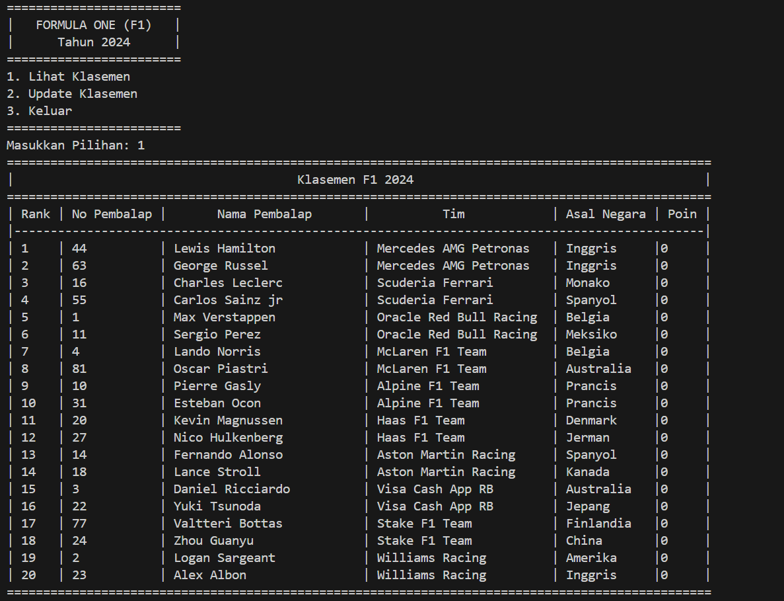
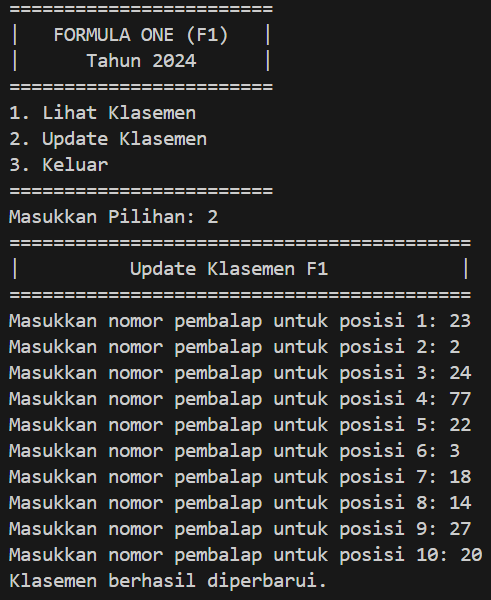
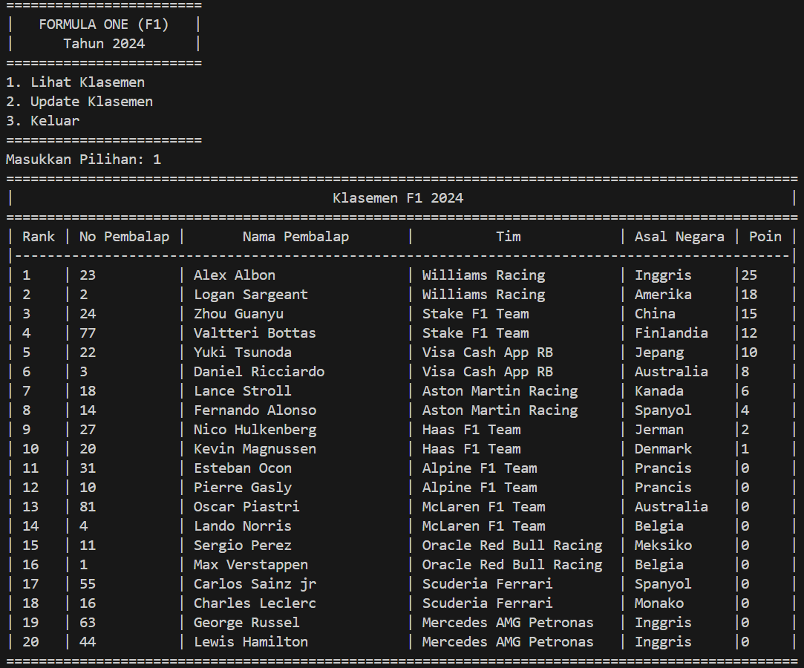
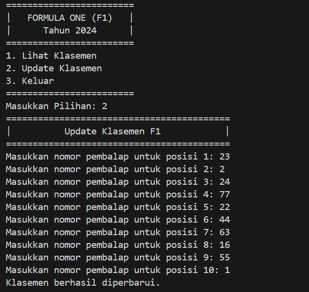
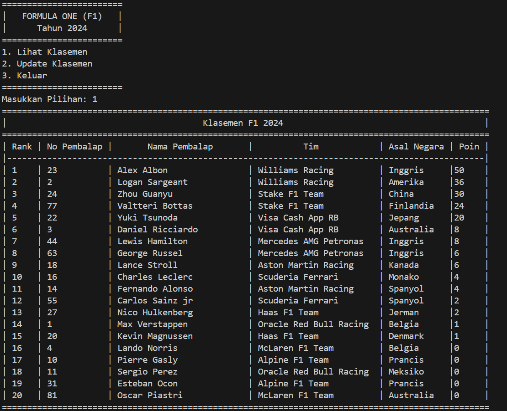

# <p align ="center">  LAPORAN KUIS 2 ALGORITMA DAN STRUKTUR DATA </p> 
<br><br><br><br>

<p align="center">
    </p>

<br><br><br><br><br>


<p align = "center"> Nama : Adnan Arju Maulana Pasha </p>
<p align = "center"> NIM  : 2341720107 </p>
<p align = "center"> Prodi: TEKNIK INFOMATIKA</p>
<p align = "center"> Kelas: 1B </p>
<br><br><br><br><br>

# Deskripsi 
Ini adalah program yang berfungsi untuk menghitung setiap poin klasemen dari driver F1 berdasarkan posisi. Untuk klasemen bisa terupdate terus menerus jika pengguna ingin mengupdate klasemen dengan menginputkan juara 1-10 secara terus menerus

# Sistem Perhitungan Poin
Poin dihitung berdasarkan posisi<br>
Dibawah ini adalah perolehan poinnya:<br>
1. Jika mendapatkan posisi 1, maka akan mendapatkan +25 poin.
2. Jika mendapatkan posisi 2, maka akan mendapatkan +18 poin.
3. Jika mendapatkan posisi 3, maka akan mendapatkan +15 poin.
4. Jika mendapatkan posisi 4, maka akan mendapatkan +12 poin.
5. Jika mendapatkan posisi 5, maka akan mendapatkan +10 poin.
6. Jika mendapatkan posisi 6, maka akan mendapatkan +8 poin.
7. Jika mendapatkan posisi 7, maka akan mendapatkan +6 poin.
8. Jika mendapatkan posisi 8, maka akan mendapatkan +4 poin.
9. Jika mendapatkan posisi 9, maka akan mendapatkan +2 poin.
10. Jika mendapatkan posisi 10, maka akan mendapatkan +1 poin.<br>
Selain posisi diatas maka tidak akan mendapatkan poin(0)

# Kode Program
## Class Node02
```java
package Kuis2.FormulaOne;

public class Node02 {
    String[] data;
    Node02 prev;
    Node02 next;

    public Node02(String[] data) {
        this.data = data;
        this.prev = null;
        this.next = null;
    }
}
```
## Class Driver02
```java
package Kuis2.FormulaOne;

public class Driver02 {
    private String driverNumber;
    private String driverName;
    private String teamName;
    private String country;
    private int points;

    public Driver02(String driverNumber, String driverName, String teamName, int points) {
        this.driverNumber = driverNumber;
        this.driverName = driverName;
        this.teamName = teamName;
        this.country = country;
        this.points = points;
    }

    public String getDriverNumber() {
        return driverNumber;
    }

    public void setDriverNumber(String driverNumber) {
        this.driverNumber = driverNumber;
    }

    public String getDriverName() {
        return driverName;
    }

    public void setDriverName(String driverName) {
        this.driverName = driverName;
    }

    public String getTeamName() {
        return teamName;
    }

    public void setTeamName(String teamName) {
        this.teamName = teamName;
    }

    public String getCountry() {
        return country;
    }

    public void setCountry(String country) {
        this.country = country;
    }
    public int getPoints() {
        return points;
    }

    public void setPoints(int points) {
        this.points = points;
    }
    public void addPoints(int points) {
        this.points += points;
    }
}
```
## Class DoubleLinkedList02
```java
package Kuis2.FormulaOne;

public class DoubleLinkedList02 {
    Node02 head;
    Node02 tail;

    public DoubleLinkedList02() {
        head = null;
        tail = null;
    }

    public void add(String[] data) {
        Node02 newNode = new Node02(data);
        if (head == null) {
            head = tail = newNode;
        } else {
            tail.next = newNode;
            newNode.prev = tail;
            tail = newNode;
        }
    }

    public void sortByPoints() {
        Node02 current = head;
        while (current != null) {
            Node02 max = current;
            Node02 index = current.next;
            while (index != null) {
                if (Integer.parseInt(max.data[4]) < Integer.parseInt(index.data[4])) {
                    max = index;
                }
                index = index.next;
            }
            String[] temp = current.data;
            current.data = max.data;
            max.data = temp;
            current = current.next;
        }
    }public Node02 get(int index) {
        Node02 current = head;
        for (int i = 0; i < index; i++) {
            current = current.next;
        }
        return current;
    }

    public void sortDriversByPoints() {
        if (head == null || head.next == null) {
            return;
        }

        Node02 current = head;
        while (current != null) {
            Node02 max = current;
            Node02 index = current.next;
            while (index != null) {
                if (Integer.parseInt(max.data[4]) < Integer.parseInt(index.data[4])) {
                    max = index;
                }
                index = index.next;
            }
            String[] temp = current.data;
            current.data = max.data;
            max.data = temp;
            current = current.next;
        }
    }

    public Node02 findByNumber(int nomorPembalap) {
        Node02 current = head;
        while (current != null) {
            if (Integer.parseInt(current.data[0]) == nomorPembalap) {
                return current;
            }
            current = current.next;
        }
        return null;
    }    
}
```
## Class DLLMain02
```java
package Kuis2.FormulaOne;

import java.util.Scanner;

public class DLLMain02 {
    static DoubleLinkedList02 dataPembalap = new DoubleLinkedList02();

    public static void main(String[] args) {
        Scanner scanner = new Scanner(System.in);

        initData();

        while (true) {
            System.out.println("========================");
            System.out.println("|   FORMULA ONE (F1)   |");
            System.out.println("|      Tahun 2024      |");
            System.out.println("========================");
            System.out.println("1. Lihat Klasemen");
            System.out.println("2. Update Klasemen");
            System.out.println("3. Keluar");
            System.out.println("========================");
            System.out.print("Masukkan Pilihan: ");
            int choice = scanner.nextInt();
            scanner.nextLine();

            switch (choice) {
                case 1:
                    lihatKlasemen();
                    break;
                case 2:
                    updateKlasemen(scanner);
                    break;
                case 3:
                    System.exit(0);
                    break;
                default:
                    System.out.println("Pilihan tidak valid.");
                    break;
            }
        }
    }

    public static void initData() {
        String[][] drivers = {
            {"44", "Lewis Hamilton", "Mercedes AMG Petronas", "Inggris", "0"},
            {"63", "George Russel", "Mercedes AMG Petronas", "Inggris", "0"},
            {"16", "Charles Leclerc", "Scuderia Ferrari", "Monako", "0"},
            {"55", "Carlos Sainz jr", "Scuderia Ferrari", "Spanyol", "0"},
            {"1", "Max Verstappen", "Oracle Red Bull Racing", "Belgia", "0"},
            {"11", "Sergio Perez", "Oracle Red Bull Racing", "Meksiko", "0"},
            {"4", "Lando Norris", "McLaren F1 Team", "Belgia", "0"},
            {"81", "Oscar Piastri", "McLaren F1 Team", "Australia", "0"},
            {"10", "Pierre Gasly", "Alpine F1 Team", "Prancis", "0"},
            {"31", "Esteban Ocon", "Alpine F1 Team", "Prancis", "0"},
            {"20", "Kevin Magnussen", "Haas F1 Team", "Denmark", "0"},
            {"27", "Nico Hulkenberg", "Haas F1 Team", "Jerman", "0"},
            {"14", "Fernando Alonso", "Aston Martin Racing", "Spanyol", "0"},
            {"18", "Lance Stroll", "Aston Martin Racing", "Kanada", "0"},
            {"3", "Daniel Ricciardo", "Visa Cash App RB", "Australia", "0"},
            {"22", "Yuki Tsunoda", "Visa Cash App RB", "Jepang", "0"},
            {"77", "Valtteri Bottas", "Stake F1 Team", "Finlandia", "0"},
            {"24", "Zhou Guanyu", "Stake F1 Team", "China", "0"},
            {"2", "Logan Sargeant", "Williams Racing", "Amerika", "0"},
            {"23", "Alex Albon", "Williams Racing", "Inggris", "0"}
        };

        for (String[] driver : drivers) {
            dataPembalap.add(driver);
        }
    }

    public static void lihatKlasemen() {
        System.out.println("=================================================================================================");
        System.out.println("|                                       Klasemen F1 2024                                        |");
        System.out.println("=================================================================================================");
        System.out.println("| Rank | No Pembalap |       Nama Pembalap       |          Tim            | Asal Negara | Poin |");
        System.out.println("|-----------------------------------------------------------------------------------------------|");
        
        dataPembalap.sortDriversByPoints();
    
        int rank = 1;
        Node02 current = dataPembalap.head;
        while (current != null) {
            System.out.printf("| %-4d | %-11s | %-25s | %-23s | %-11s |%-5s |\n", 
                rank, current.data[0], current.data[1], current.data[2], current.data[3], current.data[4]);
            rank++;
            current = current.next;
        }
    
        System.out.println("=================================================================================================");
    }
    

    public static void updateKlasemen(Scanner scanner) {
        System.out.println("==========================================");
        System.out.println("|          Update Klasemen F1            |");
        System.out.println("==========================================");
        int[] poin = {25, 18, 15, 12, 10, 8, 6, 4, 2, 1};
    
        for (int i = 0; i < 10; i++) {
            System.out.print("Masukkan nomor pembalap untuk posisi " + (i + 1) + ": ");
            int nomorPembalap = scanner.nextInt();
            scanner.nextLine(); 
    
            Node02 pembalapNode = dataPembalap.findByNumber(nomorPembalap);
    
            if (pembalapNode == null) {
                System.out.println("Nomor pembalap tidak ditemukan.");
                continue;
            }
    
            pembalapNode.data[4] = String.valueOf(Integer.parseInt(pembalapNode.data[4]) + poin[i]);
        }
    
        System.out.println("Klasemen berhasil diperbarui.");
    }
}    
```
## Output
Menampilkan Data Klasemen<br>

<br>
Mengupdate Klasemen terbaru dengan menginputkan posisi driver dengan ketentuan poin yang sudah dijelaskan pada sistem perhitungan poin<br>
<br>
Menampilkan Klasemen terbaru setelah diupdate sesuai input pengguna dengan poin terbanyak dari atas sampai kebawah<br>
<br>
Pengguna dapat mengupdate klasemen lagi dengan menginputkan posisi driver lagi.<br>
<br>
Menampilkan Klasemen yang terbaru setelah diupdate lagi sesuai input pengguna dengan poin terbanyak dari atas sampai kebawah<br>
<br>