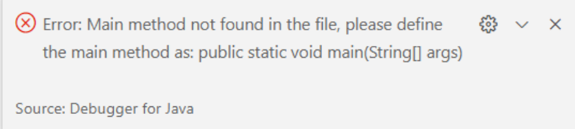

# 
  LAPORAN PRAKTIKUM ALGORITMA DAN STRUKTUR DATA 
 
    

    

     

 Nama : Adnan Arju Maulana Pasha 

 NIM  : 2341720107 

 Prodi: TEKNIK INFOMATIKA

 Kelas: 1B 

     

# Percobaan 1 : Deklarasi Class, Atribut dan Method

Ini adalah hasil kode programnya  
 
Output kode program tersebut adalah error dan cocok dengan gambar berikut 

## Pertanyaan
1. Sebutkan dua karakteristik class atau object! 
Jawab : Encapsulation: Data seperti judul, pengarang, halaman, stok, dan harga dienkapsulasi dalam class Buku dengan akses modifier private sehingga hanya dapat diakses melalui method yang ada di dalam class tersebut.
Abstraction: Class Buku memiliki method tampilInformasi yang menyembunyikan detail implementasi dan hanya menampilkan informasi yang relevan kepada pengguna.

2. Perhatikan class Buku pada Praktikum 1 tersebut, ada berapa atribut yang dimiliki oleh class 
Buku? Sebutkan apa saja atributnya! 
Jawab : Class Buku memiliki 5 atribut, yaitu:
judul (String),pengarang (String),halaman (int),stok (int),harga (int)

3. Ada berapa method yang dimiliki oleh class tersebut? Sebutkan apa saja methodnya! 
Jawab : Class Buku memiliki 4 method, yaitu:tampilInformasi(),terjual(int jml),restock(int jml),gantiHarga(int hrg)

4. Perhatikan method terjual() yang terdapat di dalam class Buku. Modifikasi isi method tersebut 
sehingga proses pengurangan hanya dapat dilakukan jika stok masih ada (lebih besar dari 0)! 
Jawab : Ini adalah modifikasi kode programnya
 
5. Menurut Anda, mengapa method restock() mempunyai satu parameter berupa bilangan int? 
Jawab : menurut saya method restock() memiliki satu parameter berupa bilangan int karena parameter tersebut digunakan untuk menentukan jumlah tambahan stok yang akan ditambahkan kembali ke dalam persediaan buku. Dengan demikian, pengguna dapat menentukan seberapa banyak stok tambahan yang ingin ditambahkan melalui parameter tersebut.
6. Commit dan push kode program ke Github
    

# Percobaan 2: Instansiasi Object, serta Mengakses Atribut dan Method

Ini adalah hasil dari kode programnya

 

## Pertanyaan

1. Pada class BukuMain, tunjukkan baris kode program yang digunakan untuk proses instansiasi!
Apa nama object yang dihasilkan? 
Jawab : baris kode program yang digunakan untuk proses instansiasi objek bk1 dari class Buku: Buku bk1 = new Buku(); 
Object yang dihasilkan bernama "bk1".
2. Bagaimana cara mengakses atribut dan method dari suatu objek? 
Jawab : dengan menggunakan nama objek diikuti dengan tanda titik (.) dan diikuti dengan nama atribut atau nama method yang ingin diakses.
3. Mengapa hasil output pemanggilan method tampilInformasi() pertama dan kedua berbeda? 
Jawab : karena ada perubahan pada atribut stok dan harga sebelum pemanggilan kedua. Pada pemanggilan pertama, atribut stok memiliki nilai 13 dan atribut harga memiliki nilai 71000. Setelah pemanggilan terjual(5) dan gantiHarga(60000), nilai atribut stok menjadi 8 dan nilai atribut harga menjadi 60000, sehingga output dari pemanggilan kedua mencerminkan perubahan tersebut. 

# Percobaan 3 : Membuat Konstruktor

Ini adalah modifikasi dalam class buku
 
Ini adalah modifikasi dalam class BukuMain
 

## Pertanyaan

1. Pada class Buku di Percobaan 3, tunjukkan baris kode program yang digunakan untuk 
mendeklarasikan konstruktor berparameter! 
Jawab : 
2. Perhatikan class BukuMain. Apa sebenarnya yang dilakukan pada baris program berikut? 
Jawab : Pada baris program tersebut, dilakukan proses instansiasi objek bk2 dari class Buku dengan menggunakan konstruktor berparameter. Nilai-nilai "Self Reward", "Maheera Ayesha", 160, 29, dan 59000 akan diteruskan sebagai argumen ke konstruktor untuk menginisialisasi atribut judul, pengarang, halaman, stok, dan harga dari objek bk2.
3. Hapus konstruktor default pada class Buku, kemudian compile dan run program. Bagaimana 
hasilnya? Jelaskan mengapa hasilnya demikian! 
Jawab : Jika konstruktor default pada class Buku dihapus, maka compile error akan terjadi saat mencoba membuat objek Buku tanpa konstruktor default. Hal ini terjadi karena compiler akan mencoba secara otomatis menggunakan konstruktor default ketika tidak ada konstruktor lain yang dapat digunakan.

4. Setelah melakukan instansiasi object, apakah method di dalam class Buku harus diakses 
secara berurutan? Jelaskan alasannya! 
Jawab : Tidak, method di dalam class Buku tidak harus diakses secara berurutan karena setiap method dalam class Buku dapat dipanggil secara terpisah sesuai dengan kebutuhan program dan tidak ada ketergantungan urutan antara pemanggilan method-method tersebut.
5. Buat object baru dengan nama buku<NamaMahasiswa> menggunakan konstruktor 
berparameter dari class Buku! 
Jawab : 
6. Commit dan push kode program ke Github 

# Latihan Praktikum

1.  Pada class Buku yang telah dibuat, tambahkan tiga method yaitu hitungHargaTotal(),
hitungDiskon(), dan hitungHargaBayar() 
Jawab :
Ini adalah hasil dari Outputnya

2. Buat program berdasarkan class diagram berikut ini!
 
Jawab :

Ini adalah hasil dari Outputnya 
