# 
  LAPORAN PRAKTIKUM ALGORITMA DAN STRUKTUR DATA 
 
    

    

     

 Nama : Adnan Arju Maulana Pasha 

 NIM  : 2341720107 

 Prodi: TEKNIK INFOMATIKA

 Kelas: 1B 

     

# Percobaan 1 : Membuat Array dari Object, Mengisi dan Menampilkan 
Ini adalah SS dari kode programnya dan sesuai dengan hasil percobaan 

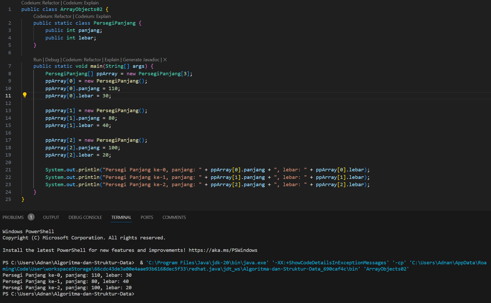 

## Pertanyaan
1. Berdasarkan uji coba 3.2, apakah class yang akan dibuat array of object harus selalu memiliki
atribut dan sekaligus method?Jelaskan! 
Jawab : 
Array of object dapat dibuat dari class yang tidak memiliki method, tetapi harus memiliki atribut. Atribut digunakan untuk menyimpan data dalam objek yang akan dimasukkan ke dalam array. Meskipun tidak memiliki method, class tersebut masih dapat digunakan untuk membuat array of object yang dapat diakses dan dimanipulasi.
2. Apakah class PersegiPanjang memiliki konstruktor?Jika tidak, kenapa dilakukan pemanggilan
konstruktur pada baris program berikut : ppArray[1] = new PersegiPanjang();
 
Jawab : 
Class PersegiPanjang tidak memiliki konstruktor secara eksplisit. Ketika tidak ada konstruktor yang didefinisikan dalam class, Java akan secara otomatis menyediakan konstruktor default yang tidak menerima argumen (default constructor). Oleh karena itu, pemanggilan new PersegiPanjang() pada baris program tersebut akan menggunakan konstruktor default yang disediakan oleh Java.
3. Apa yang dimaksud dengan kode berikut ini: PersegiPanjang[] ppArray = new PersegiPanjang[3]; 
Jawab :  
Baris kode PersegiPanjang[] ppArray = new PersegiPanjang[3]; digunakan untuk membuat sebuah array dengan tipe data PersegiPanjang yang memiliki panjang 3. Array ini akan menampung objek-objek dari class PersegiPanjang. Dengan kata lain, kita membuat array yang dapat menyimpan 3 objek PersegiPanjang.
4. Apa yang dimaksud dengan kode berikut ini: ppArray[1] = new PersegiPanjang();         ppArray[1].panjang = 80;         ppArray[1].lebar = 40; 
Jawab :  
Baris kode tersebut melakukan hal berikut:
- Membuat objek baru dari class PersegiPanjang dengan menggunakan konstruktor default: new PersegiPanjang().
- Menyimpan objek yang baru dibuat ke dalam array ppArray pada indeks 1: ppArray[1] = new PersegiPanjang();.
- Mengatur nilai atribut panjang dari objek yang disimpan di indeks 1 menjadi 80: ppArray[1].panjang = 80;.
- Mengatur nilai atribut lebar dari objek yang disimpan di indeks 1 menjadi 40: ppArray[1].lebar = 40;.
5. Mengapa class main dan juga class PersegiPanjang dipisahkan pada uji coba 3.2? 
Jawab : 
Untuk memisahkan entitas yang berbeda ke dalam file atau class yang terpisah, sehingga memudahkan dalam mengelola dan memahami kode. Pemisahan ini juga memungkinkan untuk menggunakan kelas PersegiPanjang di berbagai bagian dari program tanpa perlu menempatkannya di dalam class main. 
   
# Percobaan 2 : :  Menerima Input Isian Array Menggunakan Looping 
Ini adalah SS dari kode programnya dan sesuai dengan hasil percobaan 
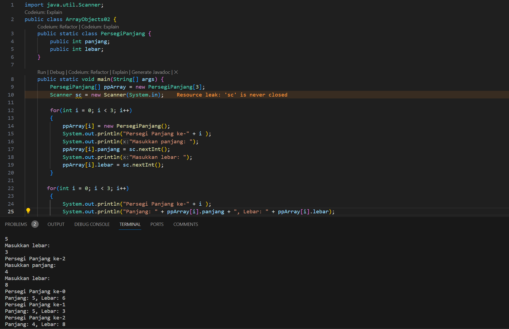

## Pertanyaan
1. Apakah array of object dapat diimplementasikan pada array 2 Dimensi? 
Jawab :  
Ya, array of object dapat diimplementasikan dalam array 2 dimensi
2. Jika jawaban soal no satu iya, berikan contohnya! Jika tidak, jelaskan! 
Jawab :  
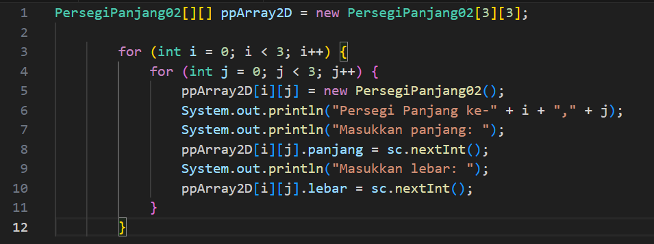
3. Jika diketahui terdapat class Persegi yang memiliki atribut sisi bertipe integer, maka kode
dibawah ini akan memunculkan error saat dijalankan. Mengapa? Persegi[] pgArray = new Persegi[100]; pgArray[5].sisi = 20; 
Jawab :  
 karena array pgArray hanya menyimpan referensi ke objek Persegi, namun pada saat ini belum ada objek yang diinisialisasi di dalam array tersebut.
4. Modifikasi kode program pada praktikum 3.3 agar length array menjadi inputan dengan Scanner! 
Jawab :  
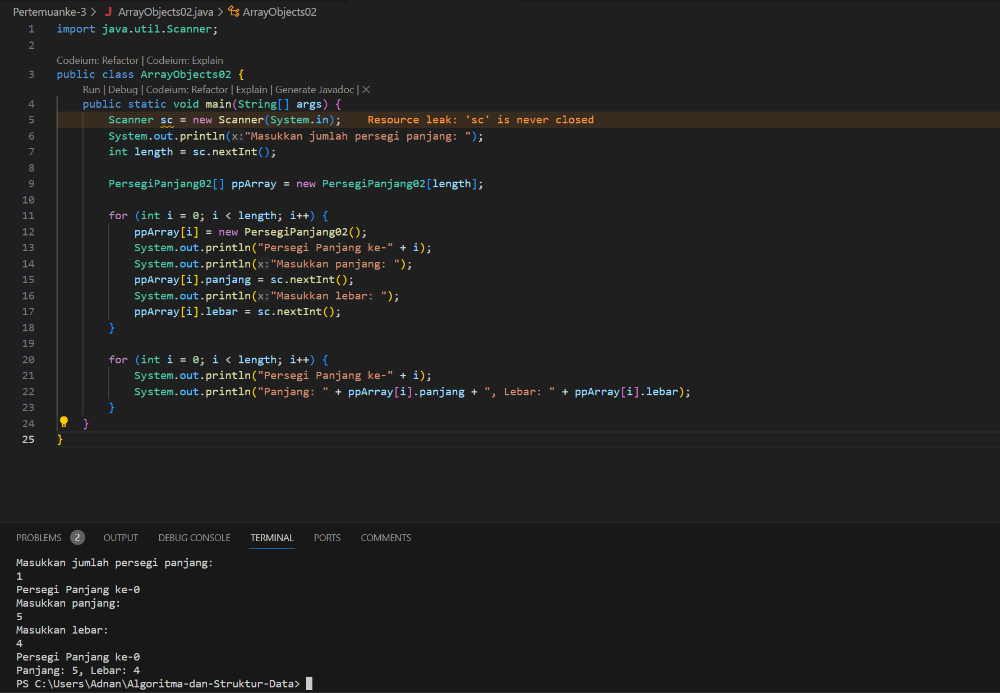
5. Apakah boleh Jika terjadi duplikasi instansiasi array of objek, misalkan saja instansiasi dilakukan
pada ppArray[i] sekaligus ppArray[0]?Jelaskan ! 
Jawab :  
Tidak boleh melakukan duplikasi instansiasi array of objek pada indeks yang sama. Misalnya, tidak boleh melakukan instansiasi pada ppArray[i] dan ppArray[0] karena indeks yang sama dan diisi dua kali dapat menyebabkan kebingungan dan potensi bug dalam program.
  

# Percobaan 3: Penambahan Operasi Matematika di Dalam Method 
Ini adalah SS dari kode programnya dan sesuai dengan hasil percobaan 
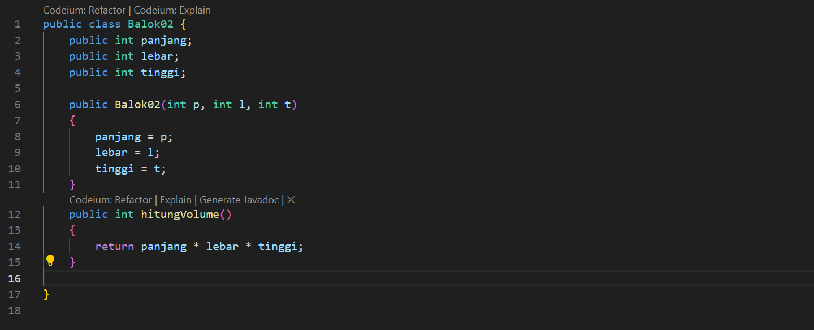
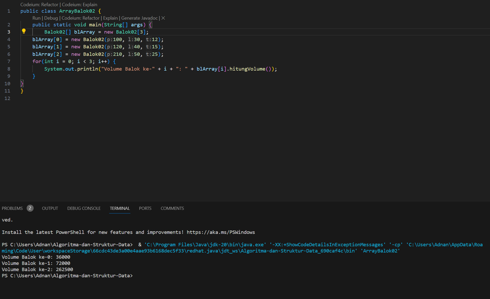

## Pertanyaan

1. Dapatkah konstruktor berjumlah lebih dalam satu kelas? Jelaskan dengan contoh! 
Jawab :  
ya, pada satu class bisa memiliki lebih dari satu konstruktor yang disebut overloading constructor. setiap konstruktor bisa memiliki parameter yang berbeda atau jumlah parameter yang berbeda. 
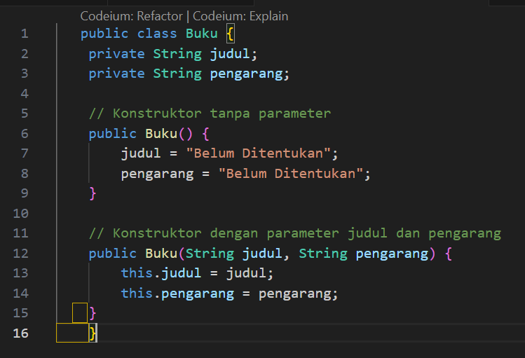
   
2. Jika diketahui terdapat class Segitiga seperti berikut ini: public class segitiga { public int alas; public int tinggi; }
Tambahkan konstruktor pada class Segitiga tersebut yang berisi parameter int a, int t
yang masing-masing digunakan untuk mengisikan atribut alas dan tinggi. 
Jawab : 
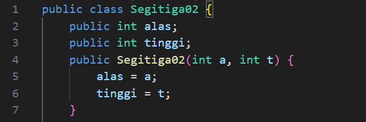
3. Tambahkan method hitungLuas() dan hitungKeliling() pada class Segitiga
tersebut. Asumsi segitiga adalah segitiga siku-siku. (Hint: Anda dapat menggunakan bantuan
library Math pada Java untuk mengkalkulasi sisi miring) 
Jawab : 
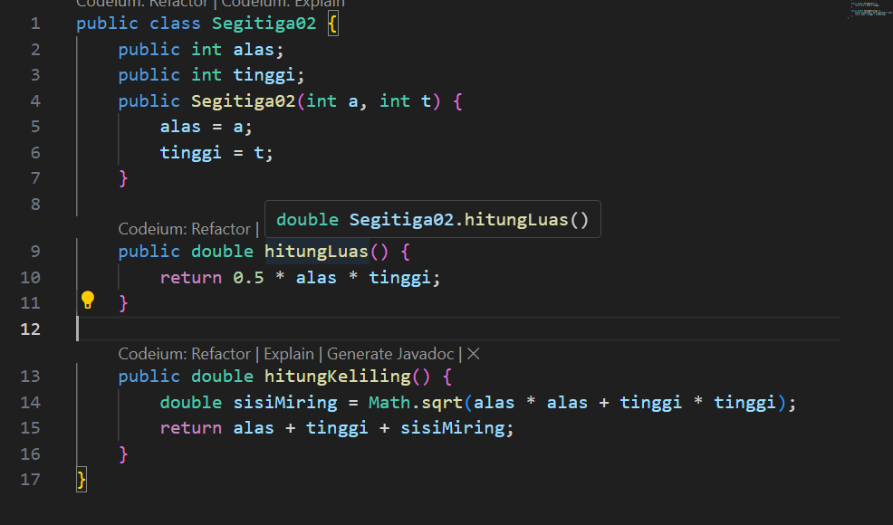
4. Pada fungsi main, buat array Segitiga sgArray yang berisi 4 elemen, isikan masing-masing
atributnya sebagai berikut:
sgArray ke-0 alas: 10, tinggi: 4
sgArray ke-1 alas: 20, tinggi: 10
sgArray ke-2 alas: 15, tinggi: 6
sgArray ke-3 alas: 25, tinggi: 10 
Jawab :  
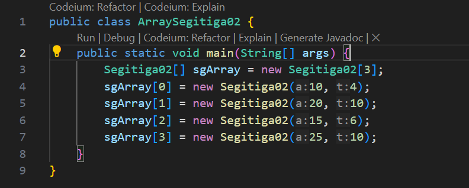
5. Kemudian menggunakan looping, cetak luas dan keliling dengan cara memanggil method
hitungLuas() dan hitungKeliling(). 
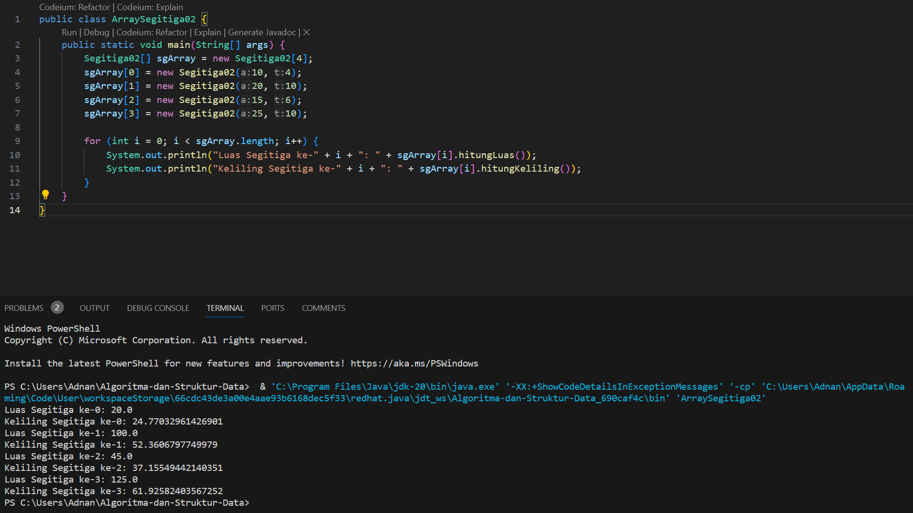