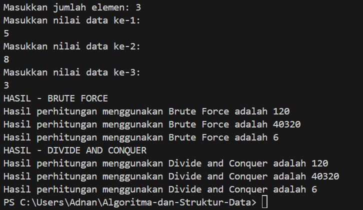
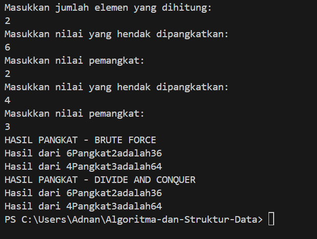
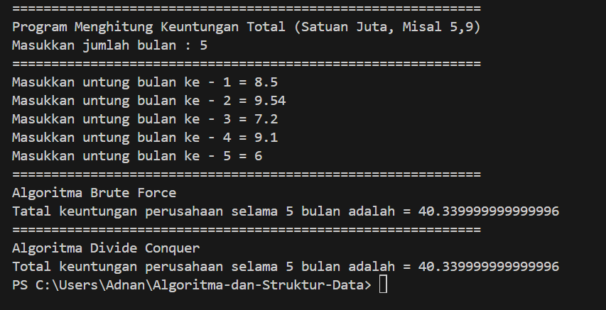
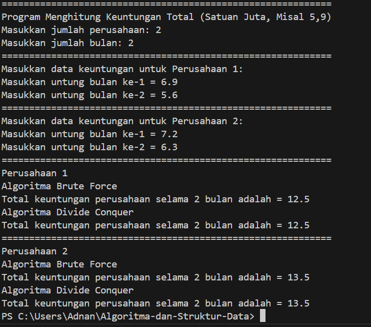
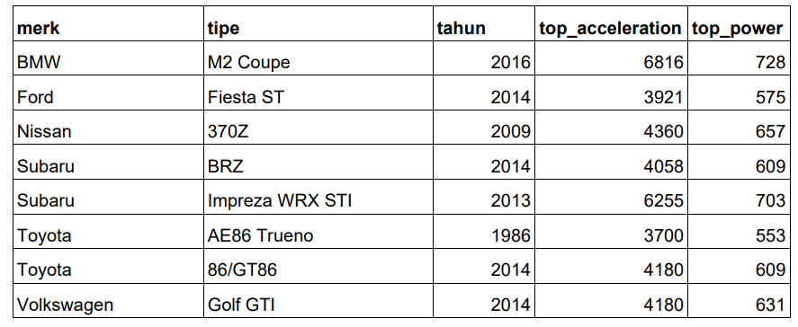
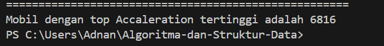
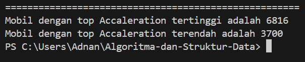
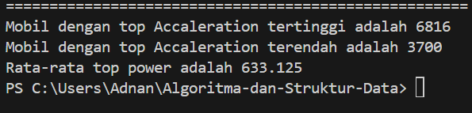

# <p align ="center">  LAPORAN PRAKTIKUM ALGORITMA DAN STRUKTUR DATA </p> 
<br><br><br><br>

<p align="center">
    </p>

<br><br><br><br><br>


<p align = "center"> Nama : Adnan Arju Maulana Pasha </p>
<p align = "center"> NIM  : 2341720107 </p>
<p align = "center"> Prodi: TEKNIK INFOMATIKA</p>
<p align = "center"> Kelas: 1B </p>
<br><br><br><br><br>

# 4.2 : Menghitung Nilai Faktorial dengan Algoritma Brute Force dan Divide and Conquer
Ini adalah SS dari kode programnya dan sesuai dengan hasil percobaan<br>
Class<br>
```java
public class Faktorial02 {
    public int nilai;
int faktorialBF(int n){
    int fakto =1;
    for(int i=1; i <=n; i++){
        fakto = fakto * i;
    }
    return fakto;
}
int faktorialDC(int n){
    if(n==1){
        return 1;
    }
    else{
        int fakto = n * faktorialDC(n-1);
        return fakto;
        }
    }
}
```
main<br>
```java
import java.util.Scanner;

public class MainFaktorial02 {
    public static void main(String[] args) {
        Scanner sc = new Scanner(System.in);

        System.out.println("---------------------------------");
        System.out.print("Masukkan jumlah elemen: ");
        int iJml = sc.nextInt();

        Faktorial02[] fk20 = new Faktorial02[10];
        for (int i = 0; i < iJml; i++) {
            fk20[i] = new Faktorial02();
            System.out.println("Masukkan nilai data ke-" + (i + 1) + ":");
            fk20[i].nilai = sc.nextInt();
        }

        System.out.println("HASIL - BRUTE FORCE");
        for (int i = 0; i < iJml; i++) {
            System.out
                    .println("Hasil perhitungan menggunakan Brute Force adalah " + fk20[i].faktorialBF(fk20[i].nilai));
        }

        System.out.println("HASIL - DIVIDE AND CONQUER");
        for (int i = 0; i < iJml; i++) {
            System.out.println(
                    "Hasil perhitungan menggunakan Divide and Conquer adalah " + fk20[i].faktorialDC(fk20[i].nilai));
        }
    }
}
```
Output<br>



## Pertanyaan
1. Pada base line Algoritma Divide Conquer untuk melakukan pencarian nilai faktorial, jelaskan 
perbedaan bagian kode pada penggunaan if dan else!<br>
Jawab : Pada algoritma divide conquer untuk mencari nilai faktorial, perbedaan dalam penggunaan if dan else terletak pada pembagian tugas antara bagian rekursif dan bagian basis dari algoritma.
Pada bagian if, kita menentukan kondisi basis (base case) di mana rekursi berhenti. Jika kondisi ini tercapai, maka hasil basis langsung dikembalikan.
Pada bagian else, kita menentukan bagaimana rekursi berlanjut. Jika kondisi basis tidak terpenuhi, maka dilakukan pemanggilan rekursif untuk memecah masalah menjadi submasalah yang lebih kecil hingga mencapai kondisi basis.
2. Apakah memungkinkan perulangan pada method faktorialBF() dirubah selain menggunakan 
for?Buktikan!<br>
Jawab : Iya, memungkinkan untuk merubah perulangan pada method faktorialBF() selain menggunakan for. Kita bisa menggunakan perulangan while atau do-while untuk menggantikan perulangan for.<br>
```java
public int faktorialBF(int n) {
    int result = 1;
    int i = 1;
    while (i <= n) {
        result *= i;
        i++;
    }
    return result;
}
```
3. Jelaskan perbedaan antara fakto *= i; dan int fakto = n * faktorialDC(n-1); !<br>
Jawab : fakto *= i; merupakan operasi penugasan gabungan (compound assignment) yang mengalikan fakto dengan nilai i dan kemudian menyimpan hasilnya kembali ke fakto. Ini digunakan dalam pendekatan brute force untuk menghitung faktorial dengan menggunakan perulangan.<br>
int fakto = n * faktorialDC(n-1); merupakan pendekatan rekursif untuk menghitung faktorial dengan menggunakan algoritma divide and conquer. Pada pendekatan ini, kita mengalikan n dengan hasil rekursif dari faktorialDC(n-1), yang secara rekursif menghitung faktorial dari n-1 hingga mencapai kondisi basis.<br>
# 4.3 : Menghitung Hasil Pangkat dengan Algoritma Brute Force dan Divide and Conquer
Ini adalah SS dari kode programnya dan sesuai dengan hasil percobaan<br>
class<br>
```java
public class Pangkat02 {
    public int nilai,Pangkat02;
        int pangkatBF(int a, int n){
            int hasil = 1;
            for(int i = 0; i < n; i++){
                hasil *= a;
            }
            return hasil ;
        }
        int pangkatDC(int a, int n){
            if(n == 0){
                return 1;
            }
            else{
                if(n%2 == 1){
                    return (pangkatDC(a, n/2) * pangkatDC(a, n/2)*a);
                }
                else{
                    return (pangkatDC(a, n/2) * pangkatDC(a, n/2));
                }
            }
        }
    }


```
main<br>
```java
import java.util.Scanner;

public class MainPangkat {
    public static void main(String[] args) {
        Scanner sc = new Scanner(System.in);
        System.out.println("---------------------------------");
        System.out.println("Masukkan jumlah elemen yang dihitung: ");
        int elemen = sc.nextInt();
        Pangkat02[] png02 = new Pangkat02[elemen];
        for(int i=0; i<elemen; i++){
            png02[i] = new Pangkat02();
            System.out.println("Masukkan nilai yang hendak dipangkatkan: ");
            png02[i].nilai = sc.nextInt();
            System.out.println("Masukkan nilai pemangkat: ");
            png02[i].Pangkat02 = sc.nextInt();
        }
        System.out.println("HASIL PANGKAT - BRUTE FORCE");
        for(int i=0; i<elemen; i++){
            System.out.println("Hasil dari "+png02[i].nilai+"Pangkat"+png02[i].Pangkat02+"adalah"+png02[i].pangkatBF(png02[i].nilai, png02[i].Pangkat02));
        }
        System.out.println("HASIL PANGKAT - DIVIDE AND CONQUER");
        for(int i=0; i<elemen; i++){
            System.out.println("Hasil dari "+ png02[i].nilai+"Pangkat"+png02[i].Pangkat02+"adalah"+png02[i].pangkatDC(png02[i].nilai, png02[i].Pangkat02));
        }
    }
}
```
Output<br>


## Pertanyaan
1. Jelaskan mengenai perbedaan 2 method yang dibuat yaitu PangkatBF() dan PangkatDC()!<br>
Jawab :<br>
pangkatBF() menggunakan pendekatan iteratif loop 'for' untuk melakukan perkalian sebanyak 'n' kali secara langsung.<br>  
pangkatDC() menggunakan pendekatan rekursif yang membagi masalah perpangkatan menjadi sub-masalah yang lebih kecil dan melakukan combine hasil diakhir.

2. Apakah tahap combine sudah termasuk dalam kode tersebut?Tunjukkan!<br>
Jawab : Iya, karena tahap combine terjadi ketika hasil dari dua penggunaan rekursif pangkatDC(a, n/2) dikalikan. Jika n adalah bilangan ganjil maka hasil tersebut juka dikalikan dengan a.
```java
if (n % 2 == 1) {
                return (pangkatDC(a, n / 2) * pangkatDC(a, n / 2) * a);
            } else {
                return (pangkatDC(a, n / 2) * pangkatDC(a, n / 2));
            }
```
3. Modifikasi kode program tersebut, anggap proses pengisian atribut dilakukan dengan 
konstruktor.<br>
Jawab :<br>
```java
public class Pangkat02 {
    public int nilai, pangkat;
    public Pangkat02(int nilai, int pangkat) {
        this.nilai = nilai;
        this.pangkat = pangkat;
    }
    int pangkatBF(int a, int n) {
        int hasil = 1;
        for (int i = 0; i < n; i++) {
            hasil *= a;
        }
        return hasil;
    }
    int pangkatDC(int a, int n) {
        if (n == 0) {
            return 1;
        } else {
            if (n % 2 == 1) {
                return (pangkatDC(a, n / 2) * pangkatDC(a, n / 2) * a);
            } else {
                return (pangkatDC(a, n / 2) * pangkatDC(a, n / 2));
            }
        }
    }
}
```
```java
import java.util.Scanner;

public class MainPangkat {
    public static void main(String[] args) {
        Scanner sc = new Scanner(System.in);

        System.out.println("====================================");
        System.out.print("Masukkan jumlah elemen yang dihitung: ");
        int elemen = sc.nextInt();

        Pangkat02[] png20 = new Pangkat02[elemen];
        for (int i = 0; i < elemen; i++) {
            System.out.println("Masukkan nilai yang hendak dipangkatkan: ");
            int nilai = sc.nextInt();
            System.out.println("Masukkan nilai pemangkat: ");
            int pangkat = sc.nextInt();
            png20[i] = new Pangkat02(nilai, pangkat);
        }

        System.out.println("HASIL PANGKAT - BRUTE FORCE");
        for (int i = 0; i < elemen; i++) {
            System.out.println("Hasil dari " + png20[i].nilai + " pangkat " + png20[i].pangkat + " adalah "
                    + png20[i].pangkatBF(png20[i].nilai, png20[i].pangkat));
        }

        System.out.println("HASIL PANGKAT - DIVIDE AND CONQUER");
        for (int i = 0; i < elemen; i++) {
            System.out.println("Hasil dari " + png20[i].nilai + " pangkat " + png20[i].pangkat + " adalah "
                    + png20[i].pangkatDC(png20[i].nilai, png20[i].pangkat));
        }
    }
}
```
4. Tambahkan menu agar salah satu method yang terpilih saja yang akan dijalankan menggunakan 
switch-case<br>
Jawab :
```java
import java.util.Scanner;

public class MainPangkat {
    public static void main(String[] args) {
        Scanner sc = new Scanner(System.in);
        System.out.println("========================================");
        System.out.println("Masukkan jumlah elemen yang dihitung: ");
        int elemen = sc.nextInt();

        Pangkat02[] png = new Pangkat02[elemen];
        for (int i = 0; i < elemen; i++) {
            System.out.println("Masukkan nilai yang hendak dipangkatkan: ");
            int nilai = sc.nextInt();
            System.out.println("Masukkan nilai pemangkat: ");
            int pangkat = sc.nextInt();
            png[i] = new Pangkat02(nilai, pangkat);
        }

        System.out.println("Pilih metode:");
        System.out.println("1. Brute Force");
        System.out.println("2. Divide and Conquer");
        System.out.print("Pilihan Anda: ");
        int pilihan = sc.nextInt();

        switch (pilihan) {
            case 1:
                System.out.println("HASIL PANGKAT - BRUTE FORCE");
                for (int i = 0; i < elemen; i++) {
                    System.out.println("Hasil dari "
                            + png[i].nilai + " pangkat "
                            + png[i].pangkat + " adalah "
                            + png[i].pangkatBF(png[i].nilai, png[i].pangkat));
                }
                break;
            case 2:
                System.out.println("HASIL PANGKAT - DIVIDE AND CONQUER");
                for (int i = 0; i < elemen; i++) {
                    System.out.println("Hasil dari "
                            + png[i].nilai + " pangkat "
                            + png[i].pangkat + " adalah "
                            + png[i].pangkatDC(png[i].nilai, png[i].pangkat));
                }
                break;
            default:
                System.out.println("Pilihan tidak valid.");
        }
    }
}
```


# 4.4 : Menghitung Sum Array dengan Algoritma Brute Force dan Divide and Conquer
Ini adalah SS dari kode programnya dan sesuai dengan hasil percobaan<br>
class
```java
public class Sum02 {
    int elemen;
    double keuntungan[], total;
    Sum02(int elemen) {
        this.elemen = elemen;
        this.keuntungan = new double[elemen];
        this.total = 0;
    }
    double totalBF(double arr[]) {
        for (int i = 0; i < elemen; i++) {
            total = total + arr[i];
        }
        return total;
    }
    double totalDC(double arr[], int l, int r) {
        if (l == r) {
            return arr[l];
        } else if (l < r) {
            int mid = (l + r) / 2;
            double lsum = totalDC(arr, l, mid);
            double rsum = totalDC(arr, mid + 1, r);
            return lsum + rsum;
        }
        return 0;
    }
}
```
main
```java
import java.util.Scanner;
public class Mainsum {
    public static void main(String[] args) {
        Scanner sc = new Scanner(System.in);
        System.out.println("============================================================");
        System.out.println("Program Menghitung Keuntungan Total (Satuan Juta, Misal 5,9)");
        System.out.print("Masukkan jumlah bulan : ");
        int elm = sc.nextInt();
        Sum02 sm = new Sum02(elm);
        System.out.println("============================================================");
        for (int i = 0; i < sm.elemen; i++) {
            System.out.print("Masukkan untung bulan ke - " + (i + 1) + " = ");
            sm.keuntungan[i] = sc.nextDouble();
        }
        System.out.println("============================================================");
        System.out.println("Algoritma Brute Force");
        System.out.println(
                "Total keuntungan perusahaan selama " + sm.elemen + " bulan adalah = " + sm.totalBF(sm.keuntungan));
        System.out.println("============================================================");
        System.out.println("Algoritma Divide Conquer");
        System.out.println("Total keuntungan perusahaan selama " + sm.elemen + " bulan adalah = "
                + sm.totalDC(sm.keuntungan, 0, sm.elemen - 1));
    }
}
```
Output<br>
<br>
## Pertanyaan
1. Mengapa terdapat formulasi return value berikut?Jelaskan<br>
```java
return lsum+rsum+arr[mid];
```
Jawab : baris kode tersebut digunakan untuk menambahkan total semua nilai dari 'lsum' yang merupakan total dari sub-array disebelah kiri, 'rsum' adalah total dari sub-array di sebelah kanan, dan 'arr[mid]' adalah elemen tengah dari array.<br>
2. Kenapa dibutuhkan variable mid pada method TotalDC()?<br>
Jawab : Variabel 'mid' digunakan untuk membagi sub-array menjadi 2 bagian yang sama besar yaitu: 'lsum' untuk kiri dan 'rsum' untuk kanan.<br>
3. Program perhitungan keuntungan suatu perusahaan ini hanya untuk satu perusahaan saja. 
Bagaimana cara menghitung sekaligus keuntungan beberapa bulan untuk beberapa 
perusahaan.(Setiap perusahaan bisa saja memiliki jumlah bulan berbeda-beda)? Buktikan 
dengan program!<br>
Jawab : Ini adalah kode programnya <br>
```java
public class Sum02 {
    int elemen;
    double[] keuntungan;
    double total;
    Sum02(int elemen) {
        this.elemen = elemen;
        this.keuntungan = new double[elemen];
        this.total = 0;
    }
    public void setKeuntungan(double[] keuntungan) {
        this.keuntungan = keuntungan;
    }
    double totalBF() {
        total = 0;
        for (int i = 0; i < elemen; i++) {
            total = total + keuntungan[i];
        }
        return total;
    }
    double totalDC(int l, int r) {
        if (l == r) {
            return keuntungan[l];
        } else if (l < r) {
            int mid = (l + r) / 2;
            double lsum = totalDC(l, mid);
            double rsum = totalDC(mid + 1, r);
            return lsum + rsum;
        }
        return 0;
    }
}
```
```java
import java.util.Scanner;

public class Mainsum {
    public static void main(String[] args) {
        Scanner sc = new Scanner(System.in);
        System.out.println("============================================================");
        System.out.println("Program Menghitung Keuntungan Total (Satuan Juta, Misal 5,9)");
        System.out.print("Masukkan jumlah perusahaan: ");
        int jumlahPerusahaan = sc.nextInt();
        System.out.print("Masukkan jumlah bulan: ");
        int jumlahBulan = sc.nextInt();

        double[][] keuntunganPerusahaan = new double[jumlahPerusahaan][jumlahBulan];

        for (int i = 0; i < jumlahPerusahaan; i++) {
            System.out.println("============================================================");
            System.out.println("Masukkan data keuntungan untuk Perusahaan " + (i + 1) + ":");
            for (int j = 0; j < jumlahBulan; j++) {
                System.out.print("Masukkan untung bulan ke-" + (j + 1) + " = ");
                keuntunganPerusahaan[i][j] = sc.nextDouble();
            }
        }

        for (int i = 0; i < jumlahPerusahaan; i++) {
            Sum02 sm = new Sum02(jumlahBulan);
            sm.setKeuntungan(keuntunganPerusahaan[i]);
            System.out.println("============================================================");
            System.out.println("Perusahaan " + (i + 1));
            System.out.println("Algoritma Brute Force");
            System.out.println("Total keuntungan perusahaan selama " + jumlahBulan + " bulan adalah = "
                    + sm.totalBF());
            System.out.println("Algoritma Divide Conquer");
            System.out.println("Total keuntungan perusahaan selama " + jumlahBulan + " bulan adalah = "
                    + sm.totalDC(0, jumlahBulan - 1));
        }
    }
}
```
Output

# 4.5 : Latihan Praktikum
1. Sebuah showroom memiliki daftar mobil dengan data sesuai tabel di bawah ini
Tentukan:<br>
a) top_acceleration tertinggi menggunakan Divide and Conquer!<br>
Jawab : Ini adalah kode programnya<br>
```java
public class DaftarMobil02 {
    String merk[] = { "BMW", "Ford", "Nissan", "Subaru", "Toyota", "Volkswagen" };
    String tipe[] = { "M2 Coupe", "Fiesta ST", "370Z", "BRZ", "Impreza WRX STI", "AE86 Trueno", "86/GT86", "Golf GTI" };
    int tahun[] = { 2016, 2014, 2009, 2014, 2013, 1986, 2014, 2014 };
    int topAcceleration[] = { 6816, 3921, 4360, 4058, 6255, 3700, 4180, 4180 };
    int topPower[] = { 728, 575, 657, 609, 703, 553, 609, 631 };
    int maxAcceleration(int arr[], int l, int r) {
        if (l == r) {
            return arr[l];
        } else {
            int mid = (l + r) / 2;
            int left = maxAcceleration(arr, l, mid);
            int right = maxAcceleration(arr, mid + 1, r);

            int maxAcceleration;
            if (left > right) {
                maxAcceleration = left;
            } else {
                maxAcceleration = right;
            }
            return maxAcceleration;
        }
    }
}
```
``` java
public class MainMobil {
    public static void main(String[] args) {
        DaftarMobil02 outputMobil = new DaftarMobil02();
        System.out.println("=====================================================");
        System.out.println("Mobil dengan top Accaleration tertinggi adalah "
                + outputMobil.maxAcceleration(outputMobil.topAcceleration, 0, outputMobil.topAcceleration.length - 1));
    }
}
```
Output<br>

b) top_acceleration terendah menggunakan Divide and Conquer!<br>
Jawab : Ini adalah kode programnya<br>
```java
public class DaftarMobil02 {
    String merk[] = { "BMW", "Ford", "Nissan", "Subaru", "Toyota", "Volkswagen" };
    String tipe[] = { "M2 Coupe", "Fiesta ST", "370Z", "BRZ", "Impreza WRX STI", "AE86 Trueno", "86/GT86", "Golf GTI" };
    int tahun[] = { 2016, 2014, 2009, 2014, 2013, 1986, 2014, 2014 };
    int topAcceleration[] = { 6816, 3921, 4360, 4058, 6255, 3700, 4180, 4180 };
    int topPower[] = { 728, 575, 657, 609, 703, 553, 609, 631 };

    int maxAcceleration(int arr[], int l, int r) {
        if (l == r) {
            return arr[l];
        } else {
            int mid = (l + r) / 2;
            int left = maxAcceleration(arr, l, mid);
            int right = maxAcceleration(arr, mid + 1, r);

            int maxAcceleration;
            if (left > right) {
                maxAcceleration = left;
            } else {
                maxAcceleration = right;
            }
            return maxAcceleration;
        }
    }

    int minAcceleration(int arr[], int l, int r) {
        if (l == r) {
            return arr[l];
        } else {
            int mid = (l + r) / 2;
            int left = minAcceleration(arr, l, mid);
            int right = minAcceleration(arr, mid + 1, r);

            int minAcceleration;
            if (left < right) {
                minAcceleration = left;
            } else {
                minAcceleration = right;
            }
            return minAcceleration;
        }
    }
}
```
```java
public class MainMobil {
    public static void main(String[] args) {
        DaftarMobil02 outputMobil = new DaftarMobil02();
        System.out.println("=====================================================");
        System.out.println("Mobil dengan top Accaleration tertinggi adalah "
                + outputMobil.maxAcceleration(outputMobil.topAcceleration, 0, outputMobil.topAcceleration.length - 1));
        System.out.println("Mobil dengan top Accaleration terendah adalah "
                + outputMobil.minAcceleration(outputMobil.topAcceleration, 0, outputMobil.topAcceleration.length - 1));
    }
}
```
Output<br>

c) Rata-rata top_power dari seluruh mobil menggunakan Brute Force<br>
Jawab : Ini adalah kode programnya<br>
```java
public class DaftarMobil02 {
    String merk[] = { "BMW", "Ford", "Nissan", "Subaru", "Toyota", "Volkswagen" };
    String tipe[] = { "M2 Coupe", "Fiesta ST", "370Z", "BRZ", "Impreza WRX STI", "AE86 Trueno", "86/GT86", "Golf GTI" };
    int tahun[] = { 2016, 2014, 2009, 2014, 2013, 1986, 2014, 2014 };
    int topAcceleration[] = { 6816, 3921, 4360, 4058, 6255, 3700, 4180, 4180 };
    int topPower[] = { 728, 575, 657, 609, 703, 553, 609, 631 };
    int maxAcceleration(int arr[], int l, int r) {
        if (l == r) {
            return arr[l];
        } else {
            int mid = (l + r) / 2;
            int left = maxAcceleration(arr, l, mid);
            int right = maxAcceleration(arr, mid + 1, r);
            int maxAcceleration;
            if (left > right) {
                maxAcceleration = left;
            } else {
                maxAcceleration = right;
            }
            return maxAcceleration;
        }
    }
    int minAcceleration(int arr[], int l, int r) {
        if (l == r) {
            return arr[l];
        } else {
            int mid = (l + r) / 2;
            int left = minAcceleration(arr, l, mid);
            int right = minAcceleration(arr, mid + 1, r);
            int minAcceleration;
            if (left < right) {
                minAcceleration = left;
            } else {
                minAcceleration = right;
            }
            return minAcceleration;
        }
    }
    double rataPower() {
        double totalPower = 0;
        for (int i = 0; i < topPower.length; i++) {
            totalPower += topPower[i];
        }
        return totalPower / topPower.length;
    }
}
```
```java
public class MainMobil {
    public static void main(String[] args) {
        DaftarMobil02 outputMobil = new DaftarMobil02();
        System.out.println("=====================================================");
        System.out.println("Mobil dengan top Accaleration tertinggi adalah "
                + outputMobil.maxAcceleration(outputMobil.topAcceleration, 0, outputMobil.topAcceleration.length - 1));
        System.out.println("Mobil dengan top Accaleration terendah adalah "
                + outputMobil.minAcceleration(outputMobil.topAcceleration, 0, outputMobil.topAcceleration.length - 1));
        System.out.println("Rata-rata top power adalah " + outputMobil.rataPower());
    }
}
```
Output<br>
