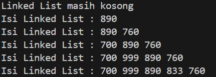
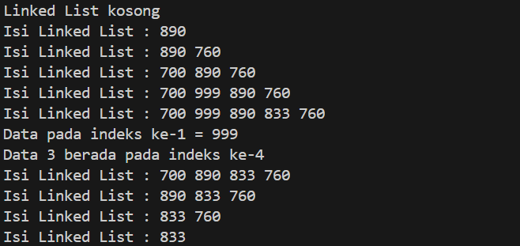
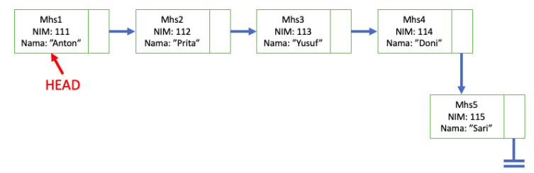
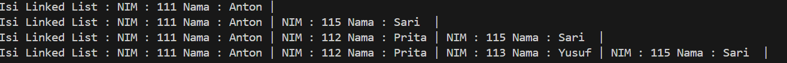
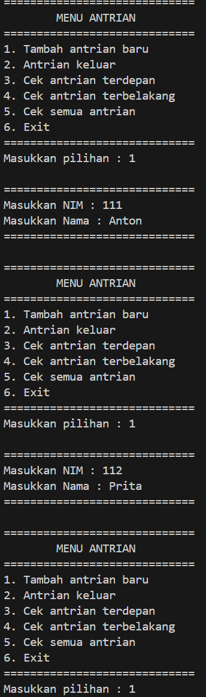
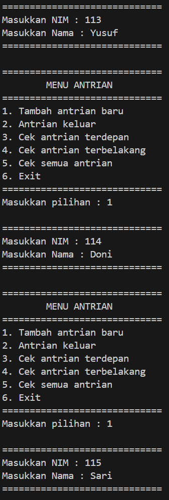
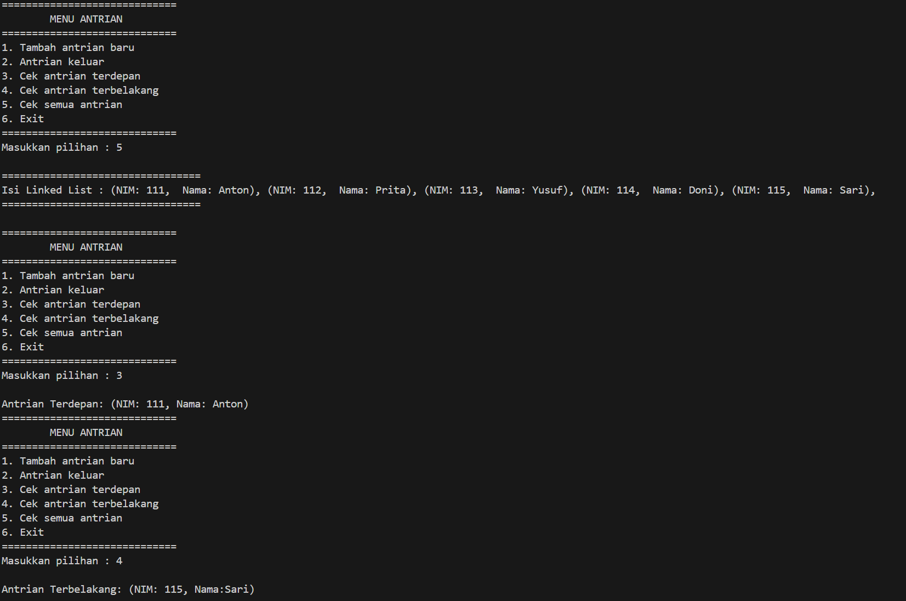

# <p align ="center">  LAPORAN PRAKTIKUM ALGORITMA DAN STRUKTUR DATA </p> 
<br><br><br><br>

<p align="center">
    </p>

<br><br><br><br><br>


<p align = "center"> Nama : Adnan Arju Maulana Pasha </p>
<p align = "center"> NIM  : 2341720107 </p>
<p align = "center"> Prodi: TEKNIK INFOMATIKA</p>
<p align = "center"> Kelas: 1B </p>
<br><br><br><br><br>

# Praktikum 1  
Ini adalah SS dari kode programnya dan sesuai dengan hasil percobaan<br>
```java
package Pertemuanke11.src;

public class Node02 {
    int data;
    Node02 next;
    Node02(int nilai, Node02 berikutnya) {
        data = nilai;
        next = berikutnya;
    }
}
```
```java
package Pertemuanke11.src;

public class SingleLinkedList02 {
    Node02 head, tail;

    boolean isEmpty() {
        return head == null;
    }

    void print() {
        if (!isEmpty()) {
            Node02 bantu = head;
            System.out.print("Isi Linked List");
            while (bantu != null) {
                System.out.print(bantu.data + " ");
                bantu = bantu.next;
            }
            System.out.println("");
        } else {
            System.out.println("Linked List kosong");
        }
    }

    void addFirst(int input) {
        Node02 ndInput = new Node02(input, null);
        if (isEmpty()) {
            head = ndInput;
            tail = ndInput;
        } else {
            ndInput.next = head;
            head = ndInput;
        }
    }

    void addLast(int input) {
        Node02 ndInput = new Node02(input, null);
        if (isEmpty()) {
            head = ndInput;
        } else {
            tail.next = ndInput;
        }
        tail = ndInput;
    }

    void insertAfter(int key, int input) {
        Node02 ndInput = new Node02(input, null);
        Node02 temp = head;
        do {
            if (temp.data == key) {
                ndInput.next = temp.next;
                temp.next = ndInput;
                if (ndInput.next != null) {
                    tail = ndInput;
                    break;
                }
            }
            temp = temp.next;
        } while (temp == null);
    }

    void insertAt(int index, int input) {
        if (index < 0) {
            System.out.println("Index tidak boleh negatif");
            return;
        }
        if (index == 0) {
            addFirst(input);
            return;
        }
        Node02 ndInput = new Node02(input, null);
        Node02 temp = head;
        for (int i = 0; i < index - 1; i++) {
            if (temp == null) {
                System.out.println("Indeks melebihi panjang linked list");
                return;
            }
            temp = temp.next;
        }
        if (temp == null) {
            System.out.println("Indeks melebihi panjang linked list");
            return;
        }
        ndInput.next = temp.next;
        temp.next = ndInput;
        if (ndInput.next == null) {
            tail = ndInput;
        }
    }
}
```
```java
package Pertemuanke11.src;

public class SLLMain02 {
        public static void main(String[] args) {
            SingleLinkedList02 singLL = new SingleLinkedList02();
            singLL.print();
            singLL.addFirst(890);
            singLL.print();
            singLL.addLast(760);
            singLL.print();
            singLL.addFirst(700);
            singLL.print();
            singLL.insertAfter(700, 999);
            singLL.print();
            singLL.insertAt(3, 833);
            singLL.print();
        }
    }
```
<br>Output<br>


## Pertanyaan
1. Mengapa hasil compile kode program di baris pertama menghasilkan “Linked List Kosong”?<br>
Jawab : Karena program tersebut melakukan print data kosong dahulu dan belum di inputkan linked list nya. Setelah di print baru di inputkan datanya<br>
2. Jelaskan kegunaan variable temp secara umum pada setiap method!<br>
Jawab : digunakan untuk membantu dalam menemukan posisi yang tepat untuk menyisipkan node dalam linked list<br>
3. Perhatikan class SingleLinkedList, pada method insertAt Jelaskan kegunaan kode berikut<br>
```java
if(temp.next.next==null) tail=temp.next;
```
<br>
Jawab : digunakan untuk mengatur variabel tail ketika kita menambahkan node baru pada posisi terakhir dalam linked list<br>

# Praktikum 2 
Modifikasi Elemen pada Single Linked List<br>

Tambahakn function pada Class SingleLinkedList
```java
int getData(int index) {
        Node02 tmp = head;
        for (int i = 0; i < index - 1; i++) {
            tmp = tmp.next;
        }
        return tmp.next.data;
    }

    int indexOf(int key) {
        Node02 tmp = head;
        int index = 0;
        while (tmp != null && tmp.data != key) {
            tmp = tmp.next;
            index++;
        }
        if (tmp == null) {
            return -1;
        } else {
            return index;
        }
    }

    void removeFirst() {
        if (isEmpty()) {
            System.out.println("Linked list masih kosong, tidak dapat dihapus");
        } else if (head == tail) {
            head = tail = null;
        } else {
            head = head.next;
        }
    }

    void removeLast() {
        if (isEmpty()) {
            System.out.println("Linked list masih kosong, tidak dapat dihapus");
        } else if (head == tail) {
            head = tail = null;
        } else {
            Node02 temp = head;
            while (temp.next == null) {
                temp = temp.next;
            }
            temp.next = null;
            tail = temp.next;
        }
    }

    void remove(int key) {
        if (isEmpty()) {
            System.out.println("Linked List masih kosong, tidak dapat dihapus");
        } else {
            Node02 temp = head;
            while (temp != null) {
                if (temp.data == key && temp == head) {
                    removeFirst();
                    break;
                } else if (temp.next.data == key) {
                    temp.next = temp.next.next;
                    if (temp.next == null) {
                        tail = temp;
                    }
                    break;
                }
                temp = temp.next;
            }
        }
    }

    public void removeAt(int index) {
        if (index == 0) {
            removeFirst();
        } else {
            Node02 temp = head;
            for (int i = 0; i < index; i++) {
                temp = temp.next;
            }
            temp.next = temp.next.next;
            if (temp.next == null) {
                tail = temp;
            }
        }
    }
```
Class SLLMain<br>
```java
package Pertemuanke11.src;

public class SLLMain20 {
    public static void main(String[] args) {
        SingleLinkedList02 singLL = new SingleLinkedList02();
        singLL.print();
        singLL.addFirst(890);
        singLL.print();
        singLL.addLast(760);
        singLL.print();
        singLL.addFirst(700);
        singLL.print();
        singLL.insertAfter(700, 999);
        singLL.print();
        singLL.insertAt(3, 833);
        singLL.print();

        System.out.println("Data pada indeks ke-1 = " + singLL.getData(1));
        System.out.println("Data 3 berada pada indeks ke-" + singLL.indexOf(760));

        singLL.remove(999);
        singLL.print();
        singLL.removeAt(0);
        singLL.print();
        singLL.removeFirst();
        singLL.print();
        singLL.removeLast();
        singLL.print();
    }
}
```
<br>Output<br>


## Pertanyaan
1. Mengapa digunakan keyword break pada fungsi remove? Jelaskan!<br>
Jawab : untuk keluar dari loop setelah elemen dengan key yang ditentukan ditemukan dan dihapus.<br>
2. Jelaskan kegunaan kode dibawah pada method remove<br>
```java
else if (temp.next.data == key) {
    temp.next = temp.next.next;
```
Jawab : digunakan untuk mencari nilai node yang mempunyai nilai yang sama dengan key. Setelah node ditemukan akan dilakukan operasi penghapusan dari linked list dengan mengubah referensi 'next' dari node saat temp ke node setelah node yang akan dihapus.<br>
# Tugas
1. Implementasikan ilustrasi Linked List Berikut. Gunakan 4 macam penambahan data yang telah dipelajari sebelumnya untuk menginputkan data.<br>
<br>
Jawab : Didalam folder tugas1
```java
package Pertemuanke11.tugas1;

public class Node02 {
    int NIM;
    String nama;
    Node02 next;

    Node02(int NIM, String nama, Node02 berikutnya) {
        this.NIM = NIM;
        this.nama = nama;
        next = berikutnya;
    }
}
```
```java
package Pertemuanke11.tugas1;

public class SingleLinkedList02 {
    Node02 head, tail;

    boolean isEmpty() {
        return head == null;
    }

    void print() {
        if (!isEmpty()) {
            Node02 tmp = head;
            System.out.print("Isi Linked List : ");
            while (tmp != null) {
                System.out.print("NIM : " + tmp.NIM + " Nama : " + tmp.nama + " | ");
                tmp = tmp.next;

            }
            System.out.println("");
        } else {
            System.out.println("Linked List kosong");
        }
    }

    void addFirst(int NIM, String nama) {
        Node02 ndInput = new Node02(NIM, nama, null);
        if (isEmpty()) {
            head = ndInput;
            tail = ndInput;
        } else {
            ndInput.next = head;
            head = ndInput;
        }
    }

    void addLast(int NIM, String nama) {
        Node02 ndInput = new Node02(NIM, nama, null);
        if (isEmpty()) {
            head = ndInput;
        } else {
            tail.next = ndInput;
        }
        tail = ndInput;
    }

    void insertAfter(int keyNIM, String keyNama, int NIM, String nama) {
        Node02 ndInput = new Node02(NIM, nama, null);
        Node02 temp = head;
        do {
            if (temp.NIM == keyNIM && temp.nama.equals(keyNama)) {
                ndInput.next = temp.next;
                temp.next = ndInput;
                if (ndInput.next != null) {
                    tail = ndInput;
                }
                break;
            }
            temp = temp.next;
        } while (temp != null);
    }

    void insertAt(int index, int NIM, String nama) {
        if (index < 0) {
            System.out.println("Index tidak boleh negatif");
            return;
        }
        if (index == 0) {
            addFirst(NIM, nama);
            return;
        }
        Node02 ndInput = new Node02(NIM, nama, null);
        Node02 temp = head;
        for (int i = 0; i < index - 1; i++) {
            if (temp == null) {
                System.out.println("Indeks melebihi panjang linked list");
                return;
            }
            temp = temp.next;
        }
        if (temp == null) {
            System.out.println("Indeks melebihi panjang linked list");
            return;
        }
        ndInput.next = temp.next;
        temp.next = ndInput;
        if (ndInput.next == null) {
            tail = ndInput;
        }
    }

    void removeFirst() {
        if (isEmpty()) {
            System.out.println("Linked list masih kosong, tidak dapat dihapus");
        } else if (head == tail) {
            head = tail = null;
        } else {
            head = head.next;
        }
    }

    void removeLast() {
        if (isEmpty()) {
            System.out.println("Linked list masih kosong, tidak dapat dihapus");
        } else if (head == tail) {
            head = tail = null;
        } else {
            Node02 temp = head;
            while (temp.next != tail) {
                temp = temp.next;
            }
            temp.next = null;
            tail = temp;
        }
    }

    void remove(int keyNIM, String keyNama) {
        if (isEmpty()) {
            System.out.println("Linked List masih kosong, tidak dapat dihapus");
        } else {
            Node02 temp = head;
            while (temp != null) {
                if (temp.NIM == keyNIM && temp.nama.equals(keyNama) && temp == head) {
                    removeFirst();
                    break;
                } else if (temp.next != null && temp.next.NIM == keyNIM && temp.next.nama.equals(keyNama)) {
                    temp.next = temp.next.next;
                    if (temp.next == null) {
                        tail = temp;
                    }
                    break;
                }
                temp = temp.next;
            }
        }
    }

    public void removeAt(int index) {
        if (index == 0) {
            removeFirst();
        } else {
            Node02 temp = head;
            for (int i = 0; i < index - 1; i++) {
                temp = temp.next;
            }
            temp.next = temp.next.next;
            if (temp.next == null) {
                tail = temp;
            }
        }
    }
}
```
```java
package Pertemuanke11.tugas1;

public class SLLMain02 {
    public static void main(String[] args) {
        SingleLinkedList02 singLL = new SingleLinkedList02();
        singLL.addFirst(111, "Anton");
        singLL.print();
        singLL.addLast(115, "Sari ");
        singLL.print();
        singLL.insertAfter(111, "Anton", 112, "Prita");
        singLL.print();
        singLL.insertAt(2, 113, "Yusuf");
        singLL.print();
    }
}
```
<br>Output<br>


2. Buatlah implementasi program antrian layanan unit kemahasiswaan sesuai dengan kondisi yang ditunjukkan pada soal nomor 1! Ketentuan<br>
a. Implementasi antrian menggunakan Queue berbasis Linked List!<br>
b. Program merupakan proyek baru, bukan modifikasi dari soal nomor 1!<br>
Jawab : Didalam folder tugas2
```java
package Pertemuanke11.tugas2;

public class Node02 {
    int NIM;
    String nama;
    Node02 next;

    Node02(int NIM, String nama, Node02 berikutnya) {
        this.NIM = NIM;
        this.nama = nama;
        next = berikutnya;
    }
}
```
```java
package Pertemuanke11.tugas2;

public class QueueLinkedList02 {
    Node02 head, tail;

    boolean isEmpty() {
        return head == null;
    }

    void print() {
        if (!isEmpty()) {
            Node02 bantu = head;
            System.out.println("=================================");
            System.out.print("Isi Linked List : ");
            while (bantu != null) {
                System.out.print("(NIM: " + bantu.NIM + ", " + " Nama: " + bantu.nama + "), ");
                bantu = bantu.next;
            }
            System.out.println("");
            System.out.println("=================================");
            System.out.println();
        } else {
            System.out.println("Linked List masih kosong");
        }
    }

    void addLast(int NIM, String nama) {
        Node02 ndInput = new Node02(NIM, nama, null);
        if (isEmpty()) {
            head = ndInput;
        } else {
            tail.next = ndInput;
        }
        tail = ndInput;
    }

    void removeFirst() {
        if (isEmpty()) {
            System.out.println("Linked list masih kosong, tidak dapat dihapus");
        } else if (head == tail) {
            head = tail = null;
        } else {
            head = head.next;
        }
    }

    void peekHead() {
        if (!isEmpty()) {
            System.out.println("Antrian Terdepan: (NIM: " + head.NIM + ", Nama: " + head.nama + ")");
        } else {
            System.out.println("Antrian masih kosong");
        }
    }

    void peekTail() {
        if (!isEmpty()) {
            System.out.println("Antrian Terbelakang: (NIM: " + tail.NIM + ", Nama:" + tail.nama + ")");
        } else {
            System.out.println("Antrian masih kosong");
        }
    }
}
```
```java
package Pertemuanke11.tugas2;

import java.util.Scanner;

public class SLLMain02 {
    public static void menu() {
        System.out.println("=============================");
        System.out.println("\tMENU ANTRIAN");
        System.out.println("=============================");
        System.out.println("1. Tambah antrian baru");
        System.out.println("2. Antrian keluar");
        System.out.println("3. Cek antrian terdepan");
        System.out.println("4. Cek antrian terbelakang");
        System.out.println("5. Cek semua antrian");
        System.out.println("6. Exit");
        System.out.println("=============================");
    }

    public static void main(String[] args) {
        Scanner sc = new Scanner(System.in);
        Scanner sc2 = new Scanner(System.in);

        QueueLinkedList02 Q = new QueueLinkedList02();

        int pilih = 0;
        do {
            menu();
            System.out.print("Masukkan pilihan : ");
            pilih = sc.nextInt();
            System.out.println();
            switch (pilih) {
                case 1:
                    System.out.println("=============================");
                    System.out.print("Masukkan NIM : ");
                    int NIM = sc.nextInt();
                    System.out.print("Masukkan Nama : ");
                    String nama = sc2.next();
                    Q.addLast(NIM, nama);
                    System.out.println("=============================");
                    System.out.println();
                    break;
                case 2:
                    Q.removeFirst();
                    break;
                case 3:
                    Q.peekHead();
                    break;
                case 4:
                    Q.peekTail();
                    break;
                case 5:
                    Q.print();
                    break;
                case 6:
                    System.exit(0);
                    break;
                default:
                    break;
            }
        } while (pilih != 6);
    }
}
```
<br>Output<br>

<br>
<br>
<br>