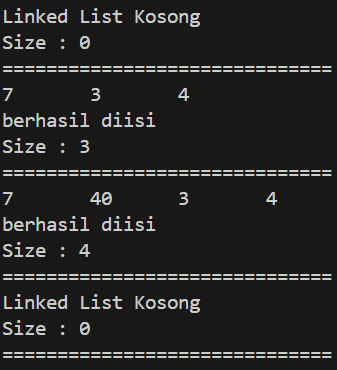
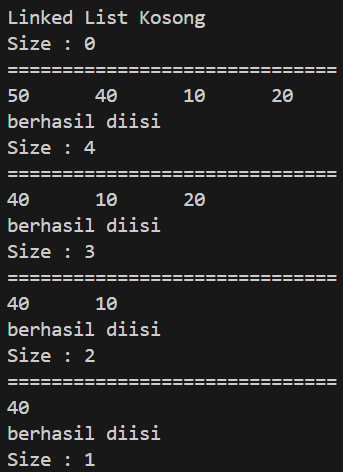
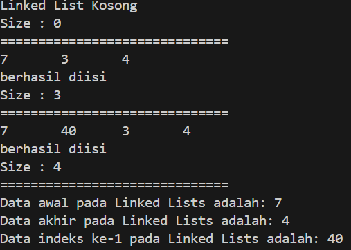

# <p align ="center">  LAPORAN PRAKTIKUM ALGORITMA DAN STRUKTUR DATA </p> 
<br><br><br><br>

<p align="center">
    </p>

<br><br><br><br><br>


<p align = "center"> Nama : Adnan Arju Maulana Pasha </p>
<p align = "center"> NIM  : 2341720107 </p>
<p align = "center"> Prodi: TEKNIK INFOMATIKA</p>
<p align = "center"> Kelas: 1B </p>
<br><br><br><br><br>

# Praktikum 1 
Ini adalah SS dari kode programnya<br>
```java
public class Node {
    int data;
    Node next, prev;

    Node(Node prev, int data, Node next) {
        this.prev = prev;
        this.data = data;
        this.next = next;
    }
}
```
```java
public class DoubleLinkedList {
    Node head;
    int size;

    public DoubleLinkedList() {
        head = null;
        size = 0;
    }

    public boolean isEmpty() {
        return head == null;
    }

    public void addFirst(int item) {
        if (isEmpty()) {
            head = new Node(null, item, null);
        } else {
            Node newNode = new Node(null, item, head);
            head.prev = newNode;
            head = newNode;
        }
        size++;
    }

    public void addLast(int item) {
        if (isEmpty()) {
            addFirst(item);
        } else {
            Node current = head;
            while (current.next != null) {
                current = current.next;
            }
            Node newNode = new Node(current, item, null);
            current.next = newNode;
            size++;
        }
    }

    public void add(int item, int index) throws Exception {
        if (isEmpty()) {
            addFirst(item);
        } else if (index < 0 || index > size) {
            throw new Exception("Nilai indeks di luar batas");
        } else {
            Node current = head;
            int i = 0;
            while (i < index) {
                current = current.next;
                i++;
            }
            if (current.prev == null) {
                Node newNode = new Node(null, item, current);
                current.prev = newNode;
                head = newNode;
            } else {
                Node newNode = new Node(current.prev, item, current);
                newNode.prev = current.prev;
                newNode.next = current;
                current.prev.next = newNode;
                current.prev = newNode;
            }
        }
        size++;
    }

    public int size() {
        return size;
    }

    public void clear() {
        head = null;
        size = 0;
    }

    public void print() {
        if (!isEmpty()) {
            Node tmp = head;
            while (tmp != null) {
                System.out.print(tmp.data + "\t");
                tmp = tmp.next;
            }
            System.out.println("\nberhasil diisi");
        } else {
            System.out.println("Linked List Kosong");
        }
    }

    public void removeFirst() throws Exception {
        if (isEmpty()) {
            throw new Exception("Linked List masih kosong, tidak dapat dihapus!");
        } else if (size == 1) {
            removeLast();
        } else {
            head = head.next;
            head.prev = null;
            size--;
        }
    }

    public void removeLast() throws Exception {
        if (isEmpty()) {
            throw new Exception("Linked List masih kosong, tidak dapat dihapus!");
        } else if (head.next == null) {
            head = null;
            size--;
            return;
        }
        Node current = head;
        while (current.next.next != null) {
            current = current.next;
        }
        current.next = null;
        size--;
    }

    public void remove(int index) throws Exception {
        if (isEmpty() || index >= size) {
            throw new Exception("Nilai indeks di luar batas");
        } else if (index == 0) {
            removeFirst();
        } else {
            Node current = head;
            int i = 0;
            while (i < index) {
                current = current.next;
                i++;
            }
            if (current.next == null) {
                current.prev.next = null;
            } else if (current.prev == null) {
                current = current.next;
                current.prev = null;
                head = current;
            } else {
                current.prev.next = current.next;
                current.next.prev = current.prev;
            }
            size--;
        }
    }

    public int getFirst() throws Exception {
        if (isEmpty()) {
            throw new Exception("Linked List masih kosong");
        }
        return head.data;
    }

    public int getLast() throws Exception {
        if (isEmpty()) {
            throw new Exception("Linked List masih kosong");
        }
        Node tmp = head;
        while (tmp.next != null) {
            tmp = tmp.next;
        }
        return tmp.data;
    }

    public int get(int index) throws Exception {
        if (isEmpty() || index >= size) {
            throw new Exception("Nilai indeks di luar batas");
        }
        Node tmp = head;
        for (int i = 0; i < index; i++) {
            tmp = tmp.next;
        }
        return tmp.data;
    }
}
```
```java
public class DoubleLinkedListsMain {
    public static void main(String[] args) throws Exception {
        DoubleLinkedList dll = new DoubleLinkedList();
        dll.print();
        System.out.println("Size : "+dll.size);
        System.out.println("==============================");
        dll.addFirst(3);
        dll.addLast(4);
        dll.addFirst(7);
        dll.print();
        System.out.println("Size : "+dll.size);
        System.out.println("==============================");
        dll.add(40, 1);
        dll.print();
        System.out.println("Size : "+dll.size);
        System.out.println("==============================");
        dll.clear();
        dll.print();
        System.out.println("Size : "+dll.size);
        System.out.println("==============================");
    }
}
```
Output<br>


## Pertanyaan
1. Jelaskan perbedaan antara single linked list dengan double linked list!<br>
Jawab : Single Linked List cocok untuk aplikasi yang hanya membutuhkan traversal satu arah atau operasi sederhana seperti penambahan di awal list.<br>
Sedangkan Double Linked List lebih cocok untuk aplikasi yang membutuhkan traversal dua arah, seperti dalam kasus aplikasi editor teks atau undo-redo stack.<br>
2. Perhatikan class Node, di dalamnya terdapat atribut next dan prev. Untuk apakah atribut tersebut?<br>
Jawab : untuk mengelola hubungan antar node dalam sebuah double linked list. Atribut next menyimpan referensi ke node berikutnya dalam linked list.Sedangkan Atribut prev menyimpan referensi ke node sebelumnya dalam linked list.<br>
3. Perhatikan konstruktor pada class DoubleLinkedLists. Apa kegunaan inisialisasi atribut head dan size seperti pada gambar berikut ini?<br>
```java
public DoubleLinkedList(){
    head = null;
    size = 0;
}
```
Jawab : Inisialisasi atribut head dengan null memastikan bahwa linked list dimulai dalam keadaan kosong, sedangkan inisialisasi size dengan 0 memungkinkan pengelolaan ukuran linked list yang efisien. Keduanya penting untuk operasi dasar pada linked list dan menjaga konsistensi struktur data selama penggunaannya.<br>
4. Pada method addFirst(), kenapa dalam pembuatan object dari konstruktor class Node prev dianggap sama dengan null?
Node newNode = new Node(null, item, head);<br>
Jawab : karena node baru yang ditambahkan di awal linked list tidak memiliki node sebelumnya. <br>
5. Perhatikan pada method addFirst(). Apakah arti statement head.prev = newNode ?<br>
Jawab : Statement head.prev = newNode digunakan untuk memperbarui node head saat ini sehingga mengakui bahwa node baru telah ditambahkan di depannya. Ini memastikan bahwa hubungan antar node dalam linked list tetap konsisten dan traversal mundur (dari head ke tail) tetap memungkinkan.
6. Perhatikan isi method addLast(), apa arti dari pembuatan object Node dengan mengisikan parameter prev dengan current, dan next dengan null?<br>
Node newNode = new Node(current, item, null);<br>
Jawab : menghubungkan node baru ke node terakhir yang ada (current) sebagai node berikutnya dan Menunjukkan bahwa node baru ini adalah node terakhir dalam list, sehingga next diatur null.<br>
7. Pada method add(), terdapat potongan kode program sebagai berikut:<br>
```java
if (current.prev == null) {
                Node newNode = new Node(null, item, current);
                current.prev = newNode;
                head = newNode;
```
Jelaskan maksud dari bagian yang ditandai dengan kotak kuning.<br>
Jawab :  digunakan untuk menambahkan node baru di depan node current yang merupakan node pertama dalam linked list. Ini mengatur prev dari current ke node baru dan memperbarui head untuk menunjuk ke node baru, sehingga node baru menjadi node pertama (head) dalam linked list.<br>
# Praktikum 2
Modifikasi Code dari Class DoubleLinkedList<br>
```java
     public void removeFirst() throws Exception {
        if (isEmpty()) {
            throw new Exception("Linked List masih kosong, tidak dapat dihapus!");
        } else if (size == 1) {
            removeLast();
        } else {
            head = head.next;
            head.prev = null;
            size--;
        }
    }

    public void removeLast() throws Exception {
        if (isEmpty()) {
            throw new Exception("Linked List masih kosong, tidak dapat dihapus!");
        } else if (head.next == null) {
            head = null;
            size--;
            return;
        }
        Node current = head;
        while (current.next.next != null) {
            current = current.next;
        }
        current.next = null;
        size--;
    }

    public void remove(int index) throws Exception {
        if (isEmpty() || index >= size) {
            throw new Exception("Nilai indeks di luar batas");
        } else if (index == 0) {
            removeFirst();
        } else {
            Node current = head;
            int i = 0;
            while (i < index) {
                current = current.next;
                i++;
            }
            if (current.next == null) {
                current.prev.next = null;
            } else if (current.prev == null) {
                current = current.next;
                current.prev = null;
                head = current;
            } else {
                current.prev.next = current.next;
                current.next.prev = current.prev;
            }
            size--;
        }
    }
```
Modifikasi Code dari class DoubleLinkedListMain<br>
```java
        dll.addLast(50);
        dll.addLast(40);
        dll.addLast(10);
        dll.addLast(20);
        dll.print();
        System.out.println("Size : "+dll.size);
        System.out.println("==============================");
        dll.removeFirst();
        dll.print();
        System.out.println("Size : "+dll.size);
        System.out.println("==============================");
        dll.removeLast();
        dll.print();
        System.out.println("Size : "+dll.size);
        System.out.println("==============================");
        dll.remove(1);
        dll.print();
        System.out.println("Size : "+dll.size);
```
Output<br>


## Pertanyaan
1. Apakah maksud statement berikut pada method removeFirst()?<br>
head = head.next;<br>
head.prev = null;<br>
Jawab : Statement head = head.next; dalam method removeFirst() digunakan untuk menggeser pointer head ke node berikutnya setelah node pertama dihapus. Sedangkan statement head.prev = null; mengatur pointer prev dari node baru yang menjadi head menjadi null, karena node tersebut sekarang menjadi node pertama dalam linked list. <br>
2. Bagaimana cara mendeteksi posisi data ada pada bagian akhir pada method removeLast()?<br>
Jawab : dengan melakukan iterasi sampai ke node terakhir kedua. Jika node terakhir kedua memiliki nilai null, maka data yang akan dihapus berada pada bagian akhir dan kita dapat menghapusnya langsung tanpa perlu melakukan iterasi lagi.<br>
3. Jelaskan alasan potongan kode program di bawah ini tidak cocok untuk perintah remove!<br>
```java
Node tmp = head.next;

head.next=tmp.next;
tmp.next.prev=head;
```
Jawab : karena tidak benar-benar menghapus node dari daftar terhubung, menyebabkan hilangnya akses ke node<br>
4. Jelaskan fungsi kode program berikut ini pada fungsi remove!<br>
```java
current.prev.next = current.next;
current.next.prev = current.prev;
```
Jawab : digunakan untuk menghubungkan node sebelumnya dan node berikutnya pada linked list. Dengan mengubah nilai next dari node sebelumnya menjadi node berikutnya, dan nilai prev dari node berikutnya menjadi node sebelumnya, kita menghapus node yang ingin dihapus dari linked list.<br>
# Praktikum 3
Modifikasi Code dari class DoubleLinkedList<br>
```java
    public int getFirst() throws Exception {
        if (isEmpty()) {
            throw new Exception("Linked List masih kosong");
        }
        return head.data;
    }

    public int getLast() throws Exception {
        if (isEmpty()) {
            throw new Exception("Linked List masih kosong");
        }
        Node tmp = head;
        while (tmp.next != null) {
            tmp = tmp.next;
        }
        return tmp.data;
    }

    public int get(int index) throws Exception {
        if (isEmpty() || index >= size) {
            throw new Exception("Nilai indeks di luar batas");
        }
        Node tmp = head;
        for (int i = 0; i < index; i++) {
            tmp = tmp.next;
        }
        return tmp.data;
    }
```
Modifikasi Code dari class DoubleLinkedListMain<br>
```java
dll.print();
        System.out.println("Size : "+dll.size);
        System.out.println("==============================");
        dll.addFirst(3);
        dll.addLast(4);
        dll.addFirst(7);
        dll.print();
        System.out.println("Size : "+dll.size);
        System.out.println("==============================");
        dll.add(40, 1);
        dll.print();
        System.out.println("Size : "+dll.size);
        System.out.println("==============================");
        System.out.println("Data awal pada Linked Lists adalah: " + dll.getFirst());
        System.out.println("Data akhir pada Linked Lists adalah: " + dll.getLast());
        System.out.println("Data indeks ke-1 pada Linked Lists adalah: " + dll.get(1));
```
Output<br>


## Pertanyaan
1. Jelaskan method size() pada class DoubleLinkedLists!<br>
Jawab : digunakan untuk mengembalikan ukuran atau jumlah elemen dalam linked list. Method ini mengembalikan nilai dari properti size, yang menyimpan jumlah elemen dalam linked list. Properti size diinisialisasi dengan nilai 0 pada saat objek DoubleLinkedList dibuat dan diperbarui setiap kali elemen ditambahkan atau dihapus dari linked list.<br>
2. Jelaskan cara mengatur indeks pada double linked lists supaya dapat dimulai dari indeks ke1!<br>
Jawab : dengan mengurangi 1 dari indeks saat mencoba mengakses elemen.<br>
3. Jelaskan perbedaan karakteristik fungsi Add pada Double Linked Lists dan Single Linked Lists!<br>
Jawab : Fungsi add() pada Double Linked Lists memungkinkan penambahan elemen ke awal, akhir, atau di tengah linked list. Sedangkan Fungsi add() pada Single Linked Lists hanya memungkinkan penambahan elemen ke akhir linked list.<br>
4. Jelaskan perbedaan logika dari kedua kode program di bawah ini!<br>
A<br>
```java
public boolean isEmpty(){
    if(size==o){
        return true;
    } else {
        return false;
    }
}
```
B<br>
```java
public boolean isEmpty() {
        return head == null;
    }
```
Jawab : Program A melakukan pengecekan apakah ukuran linked list sama dengan o. Jika benar, method ini akan mengembalikan true, yang berarti linked list kosong. Jika tidak sama dengan o, method ini akan mengembalikan false, yang berarti linked list tidak kosong. Sedangkan Program B melakukan pengecekan apakah kepala (head) linked list sama dengan null. Jika benar, method ini akan mengembalikan true, yang berarti linked list kosong. Jika tidak sama dengan null, method ini akan mengembalikan false, yang berarti linked list tidak kosong.<br>

# Tugas