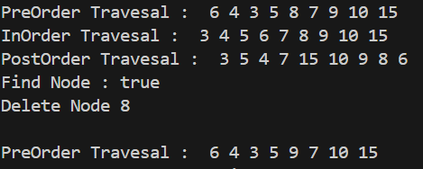
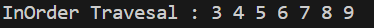
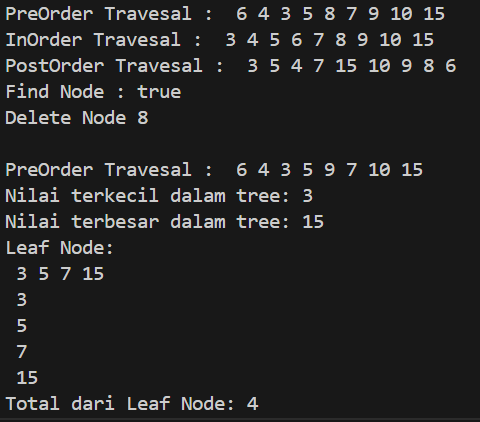
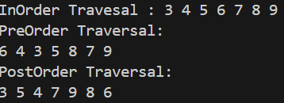

# <p align ="center">  LAPORAN PRAKTIKUM ALGORITMA DAN STRUKTUR DATA </p> 
<br><br><br><br>

<p align="center">
    </p>

<br><br><br><br><br>


<p align = "center"> Nama : Adnan Arju Maulana Pasha </p>
<p align = "center"> NIM  : 2341720107 </p>
<p align = "center"> Prodi: TEKNIK INFOMATIKA</p>
<p align = "center"> Kelas: 1B </p>
<br><br><br><br><br>

# Praktikum 1 
Ini adalah SS dari kode programnya<br>
```java
public class Node02 {
    int data;
    Node02 left;
    Node02 right;

    public Node02() {
    }

    public Node02(Node02 left, int data, Node02 right) {
        this.left = null;
        this.data = data;
        this.right = null;
    }
}
```
```java
public class BinaryTree02 {
    Node02 root;
    public BinaryTree02() {
        root = null;
}
boolean isEmpty() {
    return root == null;
}
void add(int data) {
    if (isEmpty()) { 
        root = new Node02(null, data, null);
    } else {
        Node02 current = root;
        while (true) {
            if (data < current.data) { 
                if (current.left != null) { 
                    current = current.left;
                } else {
                    current.left = new Node02(null, data, null);
                    break;
                }
            } else if (data > current.data) { 
                if (current.right != null) { 
                    current = current.right;
                } else {
                    current.right = new Node02(null, data, null); 
                    break;
                }
            } else { 
                break;
            }
        }
    }
}

boolean find(int data) {
    boolean result = false;
    Node02 current = root;
    while (current != null) { 
        if (current.data == data) { 
            result = true;
            break;
        } else if (data < current.data) { 
            current = current.left;
        } else {
            current = current.right; 
        }
    }
    return result;
}

void traversePreOrder(Node02 node) {
    if (node != null) {
        System.out.print(" " + node.data);
        traversePreOrder(node.left);
        traversePreOrder(node.right);
    }
}

void traversePostOrder(Node02 node) {
    if (node != null) {
        traversePostOrder(node.left);
        traversePostOrder(node.right);
        System.out.print(" " + node.data);
    }
}

void traverseInOrder(Node02 node) {
    if (node != null) {
        traverseInOrder(node.left);
        System.out.print(" " + node.data);
        traverseInOrder(node.right);
    }
}

Node02 getSuccessor(Node02 del) {
    Node02 successor = del.right;
    Node02 successorParent = del;
    while (successor.left != null) {
        successorParent = successor;
        successor = successor.left;
    }
    if (successor != del.right) {
        successorParent.left = successor.right;
        successor.right = del.right;
    }
    return successor;
}

void delete(int data) {
    if (isEmpty()) {
        System.out.println("Tree is empty");
        return;
    }
    
    Node02 parent = root;
    Node02 current = root;
    boolean isLeftChild = false;
    while (current != null) {
        if (current.data == data) {
            break;
        } else if (data < current.data) {
            parent = current;
            current = current.left;
            isLeftChild = true;
        } else if (data > current.data) {
            parent = current;
            current = current.right;
            isLeftChild = false;
        }
    }

    if (current == null) {
        System.out.println("Could not find data!");
        return;
    } else {

        if (current.left == null && current.right == null) {
            if (current == root) {
                root = null;
            } else {
                if (isLeftChild) {
                    parent.left = null;
                } else {
                    parent.right = null;
                }
            }
        } else if (current.left == null) { 
            if (current == root) {
                root = current.right;
            } else if (isLeftChild) {
                parent.left = current.right;
            } else {
                parent.right = current.right;
            }
        } else if (current.right == null) { 
            if (current == root) {
                root = current.left;
            } else {
                if (isLeftChild) {
                    parent.left = current.left;
                } else {
                    parent.right = current.left;
                }
            }
        } else { 
            Node02 successor = getSuccessor(current);
            if (current == root) {
                root = successor;
            } else {
                if (isLeftChild) {
                    parent.left = successor;
                } else {
                    parent.right = successor;
                }
                successor.left = current.left;
            }
        }
    }
}
}
```
```java
public class BinaryTreeMain02 {
    public static void main(String[] args) {

        BinaryTree02 bt = new BinaryTree02();
        bt.add(6);
        bt.add(4);
        bt.add(8);
        bt.add(3);
        bt.add(5);
        bt.add(7);
        bt.add(9);
        bt.add(10);
        bt.add(15);
        System.out.print("PreOrder Travesal : ");
        bt.traversePreOrder(bt.root);
        System.out.println("");
        System.out.print("InOrder Travesal : ");
        bt.traverseInOrder(bt.root);
        System.out.println("");
        System.out.print("PostOrder Travesal : ");
        bt.traversePostOrder(bt.root);
        System.out.println("");
        System.out.println("Find Node : " + bt.find(5));
        System.out.println("Delete Node 8 ");
        bt.delete(8);
        System.out.println("");
        System.out.print("PreOrder Travesal : ");
        bt.traversePreOrder(bt.root);
        System.out.println("");
    }
}
```
Output<br>


## Pertanyaan
1. Mengapa dalam binary search tree proses pencarian data bisa lebih efektif dilakukan dibanding binary tree biasa?<br>
Jawab : Dalam binary search tree, proses pencarian data bisa lebih efektif dilakukan karena setiap kali kita melakukan pencarian, kita hanya perlu memeriksa bagian tengah dari subtree saja. Jika nilai yang dicari lebih kecil dari nilai pada node tengah, maka kita hanya perlu memeriksa subtree kiri dari node tersebut. Jika nilai yang dicari lebih besar dari nilai pada node tengah, maka kita hanya perlu memeriksa subtree kanan dari node tersebut. Ini membuat waktu pencarian menjadi O(log n), yang lebih efisien daripada binary tree biasa yang memerlukan waktu pencarian O(n).<br>
2. Untuk apakah di class Node, kegunaan dari atribut left dan right?<br>
Jawab : untuk mendefinisikan anak sebelah kiri dan kanan dari current.data (node saat ini) dalam struktur BinaryTree.<br>
3. a. Untuk apakah kegunaan dari atribut root di dalam class BinaryTree?<br>
jawab: digunakan sebagai node awal dari binaryTree. Semua operasi akan dimulai dari node root sehingga root adalah sebuah node paling atas dari struktur BinaryTree.<br>
b. Ketika objek tree pertama kali dibuat, apakah nilai dari root?<br>
jawab: nilai dari root adalah null, karena tree belum menyimpan nilai apapun didalam strukturnya.<br>
4. Ketika tree masih kosong, dan akan ditambahkan sebuah node baru, proses apa yang akan terjadi?<br>
Jawab : menambahkan node baru sebagai root dari tree. Ini dilakukan dengan mengisi nilai key dari node tersebut dan mengatur nilai left dan right dari node tersebut menjadi NULL. Setelah itu, tree akan memiliki satu node saja yang menjadi root.<br>
5. Perhatikan method add(), di dalamnya terdapat baris program seperti di bawah ini. Jelaskan secara detail untuk apa baris program tersebut?<br>
```java
if(data<current.data){
 if(current.left!=null){
 current = current.left;
 }else{
 current.left = new Node(data);
 break;
 }
}
```
Jawab : <br>
kode if (data < current.data): Mengkondisikan apakah nilai data yang diberikan lebih kecil dari nilai data pada node saat ini.<br>
kode if (current.left != null): Mengkondisikan apakah subtree kiri dari node saat ini tidak kosong. Jika iya, maka kita perlu melanjutkan pencarian ke subtree kiri dari node tersebut.<br>
kode current = current.left;: Jika kondisi pada langkah 2 terpenuhi, maka kita perlu melanjutkan pencarian ke subtree kiri dari node tersebut.<br>
kode current.left = new Node(data);: Jika kondisi pada langkah 2 tidak terpenuhi, maka kita bisa menambahkan node baru dengan nilai data yang diberikan sebagai subtree kiri dari node tersebut.<br>

# Praktikum 2
Ini adalah codenya<br>
```java
package Pertemuanke14.Praktikum2;

public class BinaryTreeArray02 {
    int[] data;
    int idxLast;

    public BinaryTreeArray02() {
        data = new int[10];
    }

    void populateData(int data[], int idxLast) {
        this.data = data;
        this.idxLast = idxLast;
    }

    void traverseInOrder(int idxStart) {
        if (idxStart <= idxLast) {
            traverseInOrder(2 * idxStart + 1);
            System.out.print(data[idxStart] + " ");
            traverseInOrder(2 * idxStart + 2);
        }
    }
}
```
```java
package Pertemuanke14.Praktikum2;

public class BinaryTreeArrayMain02 {
    public static void main(String[] args) {
        BinaryTreeArray02 bta = new BinaryTreeArray02();

        int[] data = { 6, 4, 8, 3, 5, 7, 9, 0, 0, 0 };
        int idxLast = 6;
        bta.populateData(data, idxLast);
        System.out.print("InOrder Travesal : ");
        bta.traverseInOrder(0);
        System.out.print("\n");
    }
}
```
Output<br>


## Pertanyaan
1. Apakah kegunaan dari atribut data dan idxLast yang ada di class BinaryTreeArray?<br>
Jawab : Atribut data digunakan untuk menyimpan data dalam array, sedangkan atribut idxLast digunakan untuk menyimpan indeks terakhir yang terisi dalam array.<br>
2. Apakah kegunaan dari method populateData()?<br>
Jawab : untuk mengisi array data dalam objek BinaryTreeArray dengan nilai-nilai yang diberikan<br>
3. Apakah kegunaan dari method traverseInOrder()?<br>
Jawab : digunakan untuk melakukan traversal (penelusuran) dalam pohon binari yang disimpan dalam array. Traversal ini dilakukan dalam urutan yang teratur, yaitu dari nilai terkecil hingga nilai terbesar.<br>
4. Jika suatu node binary tree disimpan dalam array indeks 2, maka di indeks berapakah posisi left child dan rigth child masin-masing?<br>
Jawab : <br>
Left child: 2 * 2 + 1 = 5<br>
Right child: 2 * 2 + 2 = 6<br>
5. Apa kegunaan statement int idxLast = 6 pada praktikum 2 percobaan nomor 4?<br>
Jawab : digunakan untuk menentukan indeks terakhir dari elemen yang valid dalam array yang merepresentasikan binary tree. <br>

# Tugas Praktikum
1. Buat method di dalam class BinaryTree yang akan menambahkan node dengan cara rekursif.<br>
Jawab:<br>
```java
       void add(int data) { 
        if (isEmpty()) {
            root = new Node20(null, data, null);
        } else {
            tambahRekursif(root, data);
        }
    }

    void tambahRekursif(Node20 current, int data) { 
        if (current == null) {
            current = new Node20(null, data, null);
        } else {
            if (data < current.data) {
                if (current.left != null) {
                    tambahRekursif(current.left, data);
                } else {
                    current.left = new Node20(null, data, null);
                }
            } else if (data > current.data) {
                if (current.right != null) {
                    tambahRekursif(current.right, data);
                } else {
                    current.right = new Node20(null, data, null);
                }
            }
        }
    }
```
2. Buat method di dalam class BinaryTree untuk menampilkan nilai paling kecil dan yang paling besar yang ada di dalam tree.<br>
Jawab :<br>
```java
    int findMin() {
        Node20 current = root;
        while (current.left != null) {
            current = current.left;
        }
        return current.data;
    }

    int findMax() {
        Node20 current = root;
        while (current.right != null) {
            current = current.right;
        }
        return current.data;
    }
```
3. Buat method di dalam class BinaryTree untuk menampilkan data yang ada di leaf.<br>
```java
    void tampilLeaf(Node20 node) {
        if (node != null) {
            if (node.left == null && node.right == null) {
                System.out.print(" " + node.data);
            } else {
                tampilLeaf(node.left);
                tampilLeaf(node.right);
            }
        }
    }
```
4. Buat method di dalam class BinaryTree untuk menampilkan berapa jumlah leaf yang ada di dalam tree.<br>
Jawab :<br>
```java
    int tampilJumlahLeaf(Node20 node) {
        if (node == null) {
            return 0;
        } else if (node.left == null && node.right == null) {
            System.out.println(" " + node.data);
            return 1;
        } else {
            return tampilJumlahLeaf(node.left) + tampilJumlahLeaf(node.right);
        }
    }
```
Output dari nomor 1-4<br>
<br>
5. Modifikasi class BinaryTreeArray, dan tambahkan :<br>
• method add(int data) untuk memasukan data ke dalam tree<br>
• method traversePreOrder() dan traversePostOrder()<br>
Jawab :<br>
```java
    public BinaryTreeArray20() {
        data = new int[10];
        idxLast = -1; 
    }

        void add(int data) {
        if (idxLast == this.data.length - 1) {
            System.out.println("The Tree is Full");
            return;
        }
        idxLast++;
        this.data[idxLast] = data;
    }

    void traversePreOrder(int idxStart) {
        if (idxStart <= idxLast) {
            System.out.print(this.data[idxStart] + " ");
            traversePreOrder(2 * idxStart + 1);
            traversePreOrder(2 * idxStart + 2);
        }
    }

    void traversePostOrder(int idxStart) {
        if (idxStart <= idxLast) {
            traversePostOrder(2 * idxStart + 1);
            traversePostOrder(2 * idxStart + 2);
            System.out.print(this.data[idxStart] + " ");
        }
    }
```
```java
package Pertemuanke15.Praktikum2;

public class BinaryTreeArrayMain02 {
    public static void main(String[] args) {
        BinaryTreeArray02 bta = new BinaryTreeArray02();

        int[] data = { 6, 4, 8, 3, 5, 7, 9, 0, 0, 0 };
        int idxLast = 6;
        bta.populateData(data, idxLast);
        System.out.print("InOrder Travesal : ");
        bta.traverseInOrder(0);
        System.out.print("\n");
        System.out.println("PreOrder Traversal: ");
        bta.traversePreOrder(0);
        System.out.println(" ");
        System.out.println("PostOrder Traversal: ");
        bta.traversePostOrder(0);
        System.out.println(" ");
    }
}
```
Ouput<br>

