# <p align ="center">  LAPORAN PRAKTIKUM ALGORITMA DAN STRUKTUR DATA </p> 
<br><br><br><br>

<p align="center">
    </p>

<br><br><br><br><br>


<p align = "center"> Nama : Adnan Arju Maulana Pasha </p>
<p align = "center"> NIM  : 2341720107 </p>
<p align = "center"> Prodi: TEKNIK INFOMATIKA</p>
<p align = "center"> Kelas: 1B </p>
<br><br><br><br><br>

# Praktikum 1 
Ini adalah SS dari kode programnya<br>
```java
package Pertemuanke15Graph.src;
public class Node02 {
    int data;
    Node02 prev,next;
    int jarak;

    Node02(Node02 prev, int data, int jarak, Node02 next) {
        this.prev = prev;
        this.data = data;
        this.next = next;
        this.jarak = jarak;
    }
}
```
```java
package Pertemuanke15Graph.src;
public class DoubleLinkedList20 {
    Node02 head;
    int size;

    public DoubleLinkedList20() {
        head = null;
        size = 0;
    }

    public boolean isEmpty() {
        return head == null;
    }

    public int size() {
        return size;
    }

    public void clear() {
        head = null;
        size = 0;
    }

    public void addFirst(int item, int jarak) {
        if (isEmpty()) {
            head = new Node02(null, item, jarak, null);
        } else {
            Node02 newNode20 = new Node02(null, item, jarak, head);
            head.prev = newNode20;
            head = newNode20;
        }
        size++;
    }

    public int getJarak(int index) throws Exception {
        if (isEmpty() || index >= size) {
            throw new Exception("Nilai indeks di luar batas");
        }
        Node02 tmp = head;
        for (int i = 0; i < index; i++) {
            tmp = tmp.next;
        }
        return tmp.jarak;
    }

    public void remove(int index) {
        Node02 current = head;
        while (current != null) {
            if (current.data == index) {
                if (current.prev == null) { 
                    head = current.next; 
                    if (head != null) {
                        head.prev = null;
                    }
                } else {
                    current.prev.next = current.next;
                    if (current.next != null) {
                        current.next.prev = current.prev;
                    }
                }
                size--;
                break;
            }
            current = current.next;
        }
    }

    public int get(int index) throws Exception {
        if (isEmpty() || index >= size) {
            throw new Exception("Nilai indeks di luar batas");
        }
        Node02 tmp = head;
        for (int i = 0; i < index; i++) {
            tmp = tmp.next;
        }
        return tmp.data;
    }
}
```
```java
package Pertemuanke15Graph.src;
public class Graph02 {
        int vertex;
        DoubleLinkedList20[] list;
    
        public Graph02(int v) {
            vertex = v;
            list = new DoubleLinkedList20[v];
            for (int i = 0; i < vertex; i++) {
                list[i] = new DoubleLinkedList20();
            }
        }
    
        public void addEdge(int asal, int tujuan, int jarak) {
            list[asal].addFirst(tujuan, jarak);
        }
    
        public void degree(int asal) throws Exception {
            int totalIn = 0, totalOut = 0;
            for (int i = 0; i < vertex; i++) {
          
                for (int j = 0; j < list[i].size(); j++) {
                    if (list[i].get(j) == asal) {
                        totalIn++;
                    }
                }
             
                if (i == asal) {
                    totalOut = list[i].size();
                }
            }
            System.out.println("InDegree dari Gedung " + (char) ('A' + asal) + ": " + totalIn);
            System.out.println("OutDegree dari Gedung " + (char) ('A' + asal) + ": " + totalOut);
            System.out.println("Total Degree dari Gedung " + (char) ('A' + asal) + ": " + (totalIn + totalOut));
        }
    
        public void removeEdge(int asal, int tujuan) throws Exception {
            for (int i = 0; i < vertex; i++) {
                if (i == tujuan) {
                    list[asal].remove(tujuan);
                }
            }
        }
    
        public void removeAllEdges(int asal) throws Exception {
            for (int i = 0; i < vertex; i++) {
                list[i].clear();
            }
            System.out.println("Graph berhasil dikosongkan");
        }
    
        public void printGraph() throws Exception {
            for (int i = 0; i < vertex; i++) {
                if (list[i].size() > 0) {
                    System.out.println("Gedung " + (char) ('A' + i) + " terhubung dengan ");
                    for (int j = 0; j < list[i].size(); j++) {
                        System.out.print((char) ('A' + list[i].get(j)) + " (" + list[i].getJarak(j) + " m),");
                    }
                    System.out.println(" ");
                }
            }
            System.out.println(" ");
        }
    }
```
```java
package Pertemuanke15Graph.src;
public class GraphMain02 {
    public static void main(String[] args) {
        Graph02 gedung = new Graph02(6);
        gedung.addEdge(0, 1, 50);
        gedung.addEdge(0, 2, 100);
        gedung.addEdge(1, 3, 70);
        gedung.addEdge(2, 3, 40);
        gedung.addEdge(3, 4, 60);
        gedung.addEdge(4, 5, 80);

        try {
            gedung.removeEdge(1, 3);
            gedung.printGraph();
        } catch (Exception e) {
            e.printStackTrace();
        }
    }
}
```
Output langkah 14<br>
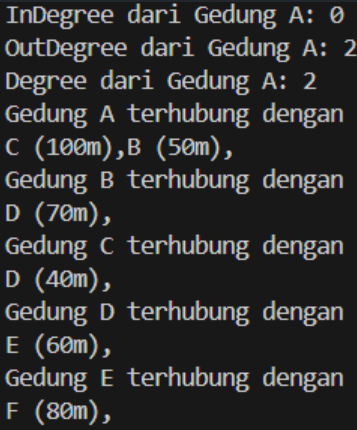<br>
Output langkah 17<br>
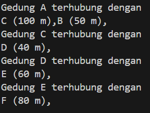<br>

## Pertanyaan 
1. Perbaiki kode program Anda apabila terdapat error atau hasil kompilasi kode tidak sesuai!<br>
Jawab : sudah diperbaiki<br>
2. Pada class Graph, terdapat atribut list[] bertipe DoubleLinkedList. Sebutkan tujuan pembuatan variabel tersebut!<br>
Jawab : untuk menyimpan dan mengelola adjacency list dalam representasi graf.<br>
3. Jelaskan alur kerja dari method removeEdge!<br>
Jawab : Method removeEdge menerima dua parameter asal dan tujuan yang merupakan indeks dari vertex yang terhubung oleh edge yang akan dihapus.Method ini menggunakan perulangan for untuk mengiterasi setiap vertex dalam list.Dalam setiap iterasi, method membandingkan indeks vertex dengan parameter tujuan.
Jika indeks vertex sama dengan parameter tujuan, maka method akan menghapus edge tersebut dari list vertex yang sesuai. Method ini menggunakan metode remove dari class ArrayList untuk menghapus edge dari list.
Jika tidak ada edge yang cocok dengan parameter tujuan, maka method tidak melakukan apa-apa. <br>
4. Apakah alasan pemanggilan method addFirst() untuk menambahkan data, bukan method add jenis lain saat digunakan pada method addEdge pada class Graph?<br>
Jawab : karena lebih cepat dan efisien dibanding dengan method add
5. Modifikasi kode program sehingga dapat dilakukan pengecekan apakah terdapat jalur antara suatu node dengan node lainnya, seperti contoh berikut (Anda dapat memanfaatkan Scanner).<br>
```java
Masukkan gedung asal: 2
Masukkan gedung tujuan: 3
Gedung C dan D bertetangga

Masukkan gedung asal: 2
Masukkan gedung tujuan: 5
Gedung C dan F tidak bertetangga
```
Jawab : dengan menambahkan method checkbertetangga<br>
```java
    public void checkBertentangga(Graph02 graph, int asal, int tujuan) {
        boolean bertetangga = false;
        try {
            for (int i = 0; i < graph.list[asal].size(); i++) {
                if (graph.list[asal].get(i) == tujuan) {
                    bertetangga = true;
                    break;
                }
            }
            if (bertetangga) {
                System.out.println(
                        "Gedung " + (char) ('A' + asal) + " dan Gedung " + (char) ('A' + tujuan) + " bertetangga");
            } else {
                System.out.println("Gedung " + (char) ('A' + asal) + " dan Gedung " + (char) ('A' + tujuan)
                        + " tidak bertetangga.");
            }
        } catch (Exception e) {
            System.out.println(e.getMessage());
        }
    }
```
Output<br>
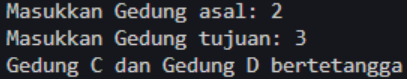
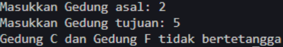

# Praktikum 2
Ini adalah SS dari kode programnya<br>
```java
package Pertemuanke15Graph.src;

public class GraphMatriks02 {
    int vertex;
    int[][] matriks;
    
    public GraphMatriks02(int v) {
        vertex = v;
        matriks = new int[v][v];
    }

    public void makeEdge(int asal, int tujuan, int jarak) {
        matriks[asal][tujuan] = jarak;
    }

    public void removeEdge(int asal, int tujuan) {
        matriks[asal][tujuan] = -1;
    }

    public void printGraph() {
        for (int i = 0; i < vertex; i++) {
            System.out.println("Gedung " + (char) ('A' + i) + ": ");
            for (int j = 0; j < vertex; j++) {
                if (matriks[i][j] != -1) {
                    System.out.print("Gedung " + (char) ('A' + j) + " (" + matriks[i][j] + " m), ");
                }
            }
            System.out.println();
        }
    }
}
```
modifikasi pada Class GraphMain02<br>
```java
        GraphMatriks02 gdg = new GraphMatriks02(4);
        gdg.makeEdge(0, 1, 50);
        gdg.makeEdge(1, 0, 60);
        gdg.makeEdge(1, 2, 70);
        gdg.makeEdge(2, 1, 80);
        gdg.makeEdge(2, 3, 40);
        gdg.makeEdge(3, 0, 90);
        gdg.printGraph();
        System.out.println("Hasil setelah penghapusan edge");
        gdg.removeEdge(2,1);
        gdg.printGraph();
```
Output<br>
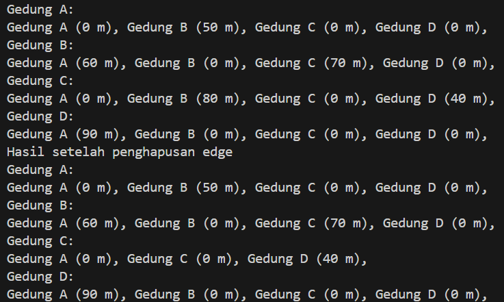

## Pertanyaan
1. Perbaiki kode program Anda apabila terdapat error atau hasil kompilasi kode tidak sesuai!<br>
Jawab : sudah diperbaiki<br>
2. Apa jenis graph yang digunakan pada Percobaan 2?<br>
Jawab : Representasi Graf Adjacency Matrix<br>
3. Apa maksud dari dua baris kode berikut?<br>
```java
gdg.makeEdge(1,2,70);
gdg.makeEdge(2,1,80);
```
Jawab : digunakan untuk menambahkan dua edge (hubungan) di dalam grafik.<br>
4. Modifikasi kode program sehingga terdapat method untuk menghitung degree, termasuk inDegree dan outDegree!<br>
Jawab :<br>
```java
    public int inDegree(int vertex) {
        int inDegree = 0;
        for (int i = 0; i < this.vertex; i++) {
            if (matriks[i][vertex] != -1) {
                inDegree++;
            }
        }
        return inDegree;
    }

    public int OutDegree(int vertex) {
        int outDegree = 0;
        for (int i = 0; i < this.vertex; i++) {
            if (matriks[vertex][i] != -1) {
                outDegree++;
            }
        }
        return outDegree;
    }

    public int totalDegree(int vertex) {
        return inDegree(vertex) + OutDegree(vertex);
    }
```
Output<br>
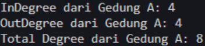

# Latihan Praktikum
1. Modifikasi kode program pada class GraphMain sehingga terdapat menu program yang bersifat dinamis, setidaknya terdiri dari:<br>
a) Add Edge<br>
b) Remove Edge<br>
c) Degree<br>
d) Print Graph<Br>
e) Cek Edge<br>
Pengguna dapat memilih menu program melalui input Scanner<br>
2. Tambahkan method updateJarak pada Percobaan 1 yang digunakan untuk mengubah jarak antara dua node asal dan tujuan!<br>
3. Tambahkan method hitungEdge untuk menghitung banyaknya edge yang terdapat di dalam graf!<br>

Jawab : modifikasi kode program<br>
1. <br>
```java
   public int inDegree(int vertex) {
        int inDegree = 0;
        try {
            for (int i = 0; i < this.vertex; i++) {
                for (int j = 0; j < list[i].size(); j++) {
                    if (list[i].get(j) == vertex) {
                        inDegree++;
                        break;
                    }
                }
            }
        } catch (Exception e) {
            System.out.println(e.getMessage());
        }
        return inDegree;
    }

    public int outDegree(int vertex) {
        return list[vertex].size();
    }

    public int totalDegree(int vertex) {
        return inDegree(vertex) + outDegree(vertex);
    }
```
2. Menambahkan method updateJarak<br>
```java
   public void updateJarak(int asal, int tujuan, int jarakBaru) {
        try {
            int index = -1;
            for (int i = 0; i < list[asal].size(); i++) {
                if (list[asal].get(i) == tujuan) {
                    index = i;
                    break;
                }
            }
            if (index != -1) {
 
                list[asal].setJarak(index, jarakBaru);
                System.out.println("Jarak antara Gedung " + (char) ('A' + asal) + " dan Gedung " + (char) ('A' + tujuan)
                        + " berhasil diupdate menjadi " + jarakBaru + " m");
            } else {
                System.out.println(
                        "Gedung " + (char) ('A' + asal) + " tidak terhubung dengan Gedung " + (char) ('A' + tujuan));
            }
        } catch (Exception e) {
            System.out.println(e.getMessage());
        }
    }
```
3. Menambahkan method hitungEdge <br>
```java
 public int hitungEdge() {
        int totalEdge = 0;
        for (int i = 0; i < vertex; i++) {
            totalEdge += list[i].size();
        }
        return totalEdge;
    }
```
Output dari soal no 1-3<br>
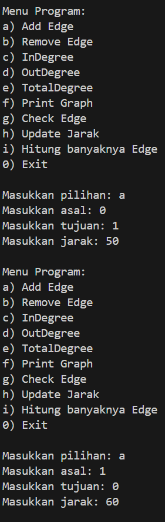<br>
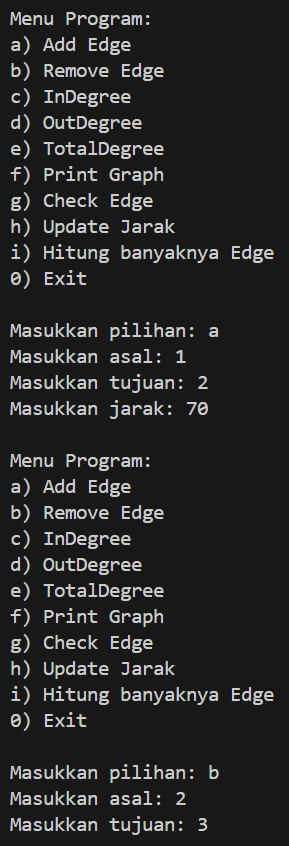<br>
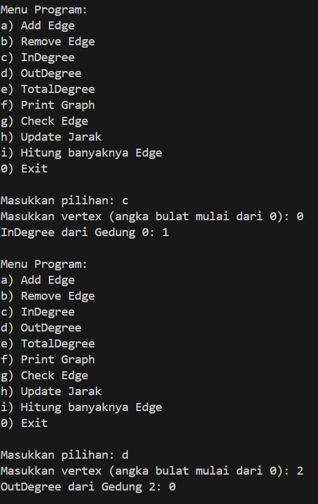<br>
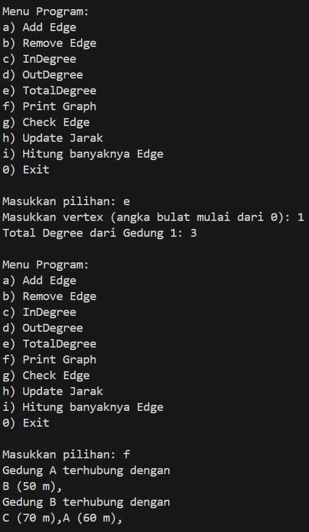<br>
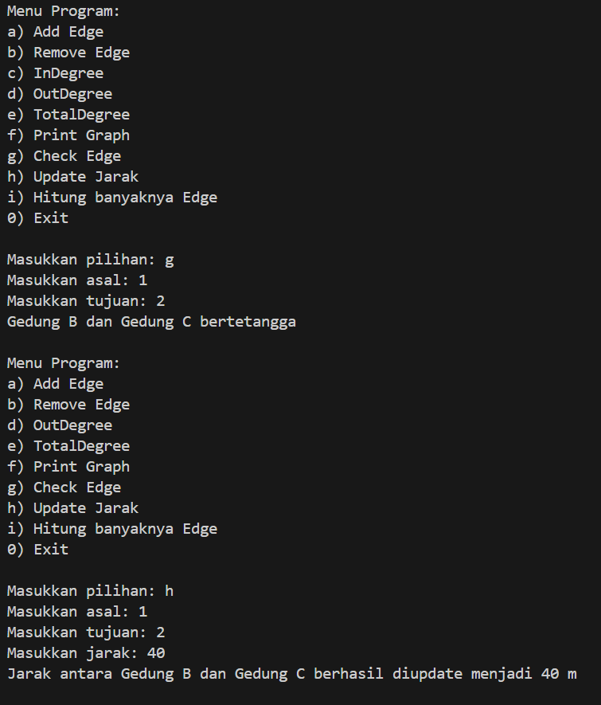<br>
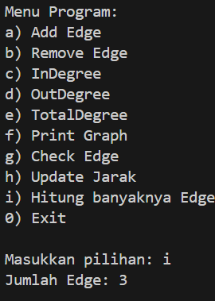<br>