# <p align ="center">  LAPORAN PRAKTIKUM ALGORITMA DAN STRUKTUR DATA </p> 
<br><br><br><br>

<p align="center">
    </p>

<br><br><br><br><br>


<p align = "center"> Nama : Adnan Arju Maulana Pasha </p>
<p align = "center"> NIM  : 2341720107 </p>
<p align = "center"> Prodi: TEKNIK INFOMATIKA</p>
<p align = "center"> Kelas: 1B </p>
<br><br><br><br><br>

# Percobaan 1 : Mengurutkan Data Mahasiswa Berdasarkan IPK Menggunakan Bubble Sort
Ini adalah SS dari kode programnya dan sesuai dengan hasil percobaan<br>
Class<br>
```java
public class DaftarmahasiswaBerprestasi02 {
    Mahasiswa02 listMhs[] = new Mahasiswa02[5];
    int idx;
 void tambah(Mahasiswa02 m){
    if(idx<listMhs.length){
        listMhs[idx] = m;
        idx++;
    }else{
        System.out.println("Data Sudah Penuh!");
    }
}
void tampil(){
    for(Mahasiswa02 m : listMhs){
        m.tampil();
        System.out.println("--------");
    }
} 
void bubblesort(){
    for(int i=0; i<listMhs.length-1; i++){
        for(int j=1; j<listMhs.length-i; j++){
            if(listMhs[j].ipk>listMhs[j-1].ipk){
                Mahasiswa02 tmp = listMhs[j];
                listMhs[j] = listMhs [j-1];
                listMhs[j-1] = tmp;
            }
        }
    }
}
}
```
```java
public class Mahasiswa02 {
    String nama ;
    int thnMasuk, umur ;
    double ipk;
    Mahasiswa02(String n, int t, int u, double i) {
        nama = n;
        thnMasuk = t;
        ipk = i;
    }

void tampil(){
    System.out.println("Nama = "+nama);
    System.out.println("Tahun Masuk = "+thnMasuk);
    System.out.println("Umur ="+umur);
    System.out.println("IPK ="+ipk);
}
}
```
```java
import java.util.Scanner;
public class main02 {
    public static void main(String[] args) {
        DaftarmahasiswaBerprestasi02 list = new DaftarmahasiswaBerprestasi02();
        Mahasiswa02 m1 = new Mahasiswa02("Nusa",2017,25,3);
        Mahasiswa02 m2 = new Mahasiswa02("Rara",2012,19,4);
        Mahasiswa02 m3 = new Mahasiswa02("Dompu",2018,19,3.5);
        Mahasiswa02 m4 = new Mahasiswa02("Abdul",2017,23,2);
        Mahasiswa02 m5 = new Mahasiswa02("Ummi",2019,21,3.75);

        list.tambah(m1);
        list.tambah(m2);
        list.tambah(m3);
        list.tambah(m4);
        list.tambah(m5);

        System.out.println("Data mahasiswa sebelum sorting = ");
        list.tampil();

        System.out.println("Data mahasiswa setelah sorting desc berdasarkan ipk");
        list.bubblesort();
        list.tampil();
    }
}
```
Output<br>

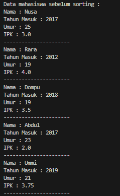<br>
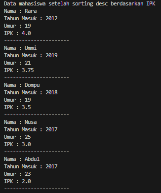

## Pertanyaan
1. Terdapat di method apakah proses bubble sort?<br>
Jawab : terdapat pada method 'bubbleSort' pada class DaftarMahasiswaBerprestasi02
2. Di dalam method bubbleSort(), terdapat baris program seperti di bawah ini:<br>
```java
if (listMhs[j].ipk > listMhs[j - 1].ipk) {
    Mahasiswa01 tmp = listMhs[j];
    listMhs[j] = listMhs[j - 1];
    listMhs[j - 1] = tmp;
}
```
Untuk apakah proses tersebut?<br>
jawab: untuk menukar posisi kedua elemen dalam array listMhs. Penukaran posisi dilakukan berdasarkan nilai IPK dari kedua elemen yang dibandingkan.<br>
3. Perhatikan perulangan di dalam bubbleSort() di bawah ini:<br>
```java
for (int i = 0; i < listMhs.length - 1; i++) {
    for (int j = 1; j < listMhs.length - i; j++) {
```
a. Apakah perbedaan antara kegunaan perulangan i dan perulangan j?
Jawab : perulangan i digunakan untuk mengatur seluruh array listMhs sedangkan j digunakan untuk membandingkan dan menukar pasangan elemen dalam array listMhs<br>
b. Mengapa syarat dari perulangan i adalah i<listMhs.length-1 ?
Jawab : pada setiap iterasi i tidak perlu membandingkan elemen terakhir dengan elemen lainnya. Karena pada setiap iterasi, elemen terbesar telah dipindahkan ke posisi yang benar di akhir array, sehingga tidak perlu dibandingkan lagi. <br>
c. Mengapa syarat dari perulangan j adalah j<listMhs.length-i ? <br>
Jawab : Karena pada setiap iterasi i, elemen terbesar telah dipindahkan ke posisi yang benar di akhir array, jadi tidak perlu membandingkan elemen terakhir dalam array dengan elemen lainnya.<br> 
d. Jika banyak data di dalam listMhs adalah 50, maka berapakali perulangan i akan berlangsung? Dan ada berapa Tahap bubble sort yang ditempuh?<br>
Jawab : Perulangan i akan berlangsung sebanyak 49 kali.<br>

# Percobaan 2 : Mengurutkan Data Mahasiswa Berdasarkan IPK Menggunakan Selection Sort
Ini adalah SS dari kode programnya dan sesuai dengan hasil percobaan<br>
```java
public class DaftarmahasiswaBerprestasi02 {
    Mahasiswa02 listMhs[] = new Mahasiswa02[5];
    int idx;
 void tambah(Mahasiswa02 m){
    if(idx<listMhs.length){
        listMhs[idx] = m;
        idx++;
    }else{
        System.out.println("Data Sudah Penuh!");
    }
}
void tampil(){
    for(Mahasiswa02 m : listMhs){
        m.tampil();
        System.out.println("--------");
    }
} 
void bubblesort(){
    for(int i=0; i<listMhs.length-1; i++){
        for(int j=1; j<listMhs.length-i; j++){
            if(listMhs[j].ipk>listMhs[j-1].ipk){
                Mahasiswa02 tmp = listMhs[j];
                listMhs[j] = listMhs [j-1];
                listMhs[j-1] = tmp;
            }
        }
        
    }
}
void selectionSort() {
    for (int i = 0; i < listMhs.length - 1; i++) {
        int idxMin = i;
        for (int j = i + 1; j < listMhs.length; j++) {
            if (listMhs[j].ipk < listMhs[idxMin].ipk) {
                idxMin = j;
            }
        }
        Mahasiswa02 tmp = listMhs[idxMin];
        listMhs[idxMin] = listMhs[i];
        listMhs[i] = tmp;
    }
}
}
```
```java
import java.util.Scanner;
public class main02 {
    public static void main(String[] args) {
        DaftarmahasiswaBerprestasi02 list = new DaftarmahasiswaBerprestasi02();
        Mahasiswa02 m1 = new Mahasiswa02("Nusa",2017,25,3);
        Mahasiswa02 m2 = new Mahasiswa02("Rara",2012,19,4);
        Mahasiswa02 m3 = new Mahasiswa02("Dompu",2018,19,3.5);
        Mahasiswa02 m4 = new Mahasiswa02("Abdul",2017,23,2);
        Mahasiswa02 m5 = new Mahasiswa02("Ummi",2019,21,3.75);

        list.tambah(m1);
        list.tambah(m2);
        list.tambah(m3);
        list.tambah(m4);
        list.tambah(m5);

        System.out.println("Data mahasiswa sebelum sorting = ");
        list.tampil();

        System.out.println("Data mahasiswa setelah sorting desc berdasarkan ipk");
        list.bubblesort();
        list.tampil();

        System.out.println("Data mahasiswa setelah sorting asc berdasarkan IPK");
        list.selectionSort();
        list.tampil();
    }
}
```
Output<br>
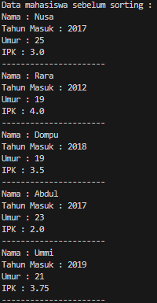<br>
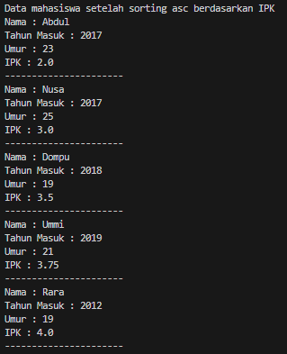<br>

## Pertanyaan
Di dalam method selection sort, terdapat baris program seperti di bawah ini:<br>
```java
int idxMin = i;
            for (int j = i + 1; j < listMhs.length; j++) {
                if (listMhs[j].ipk < listMhs[idxMin].ipk) {
                    idxMin = j;
                }
            }
```
Untuk apakah proses tersebut, jelaskan!<br>
Jawab : untuk mencari nilai IPK terkecil yang ada dalam array listMhs dengan melakukan perbandingan pada setiap indeks pada array-nya.

# Percobaan 3 : Mengurutkan Data Mahasiswa Berdasarkan IPK Menggunakan Insertion Sort
Ini adalah SS dari kode programnya dan sesuai dengan hasil percobaan<br>
```java
public class DaftarmahasiswaBerprestasi02 {
    Mahasiswa02 listMhs[] = new Mahasiswa02[5];
    int idx;
 void tambah(Mahasiswa02 m){
    if(idx<listMhs.length){
        listMhs[idx] = m;
        idx++;
    }else{
        System.out.println("Data Sudah Penuh!");
    }
}
void tampil(){
    for(Mahasiswa02 m : listMhs){
        m.tampil();
        System.out.println("--------");
    }
} 
void bubblesort(){
    for(int i=0; i<listMhs.length-1; i++){
        for(int j=1; j<listMhs.length-i; j++){
            if(listMhs[j].ipk>listMhs[j-1].ipk){
                Mahasiswa02 tmp = listMhs[j];
                listMhs[j] = listMhs [j-1];
                listMhs[j-1] = tmp;
            }
        }
        
    }
}
void selectionSort() {
    for (int i = 0; i < listMhs.length - 1; i++) {
        int idxMin = i;
        for (int j = i + 1; j < listMhs.length; j++) {
            if (listMhs[j].ipk < listMhs[idxMin].ipk) {
                idxMin = j;
            }
        }
        Mahasiswa02 tmp = listMhs[idxMin];
        listMhs[idxMin] = listMhs[i];
        listMhs[i] = tmp;
    }
}
void insertionSort() {
    for (int i = 1; i < listMhs.length; i++) {
        Mahasiswa02 temp = listMhs[i];
        int j = i;
        while (j > 0 && listMhs[j - 1].ipk > temp.ipk) {
            listMhs[j] = listMhs[j - 1];
            j--;
        }
        listMhs[j] = temp;
    }
}
}
```
```java
import java.util.Scanner;
public class main02 {
    public static void main(String[] args) {
        DaftarmahasiswaBerprestasi02 list = new DaftarmahasiswaBerprestasi02();
        Mahasiswa02 m1 = new Mahasiswa02("Nusa",2017,25,3);
        Mahasiswa02 m2 = new Mahasiswa02("Rara",2012,19,4);
        Mahasiswa02 m3 = new Mahasiswa02("Dompu",2018,19,3.5);
        Mahasiswa02 m4 = new Mahasiswa02("Abdul",2017,23,2);
        Mahasiswa02 m5 = new Mahasiswa02("Ummi",2019,21,3.75);

        list.tambah(m1);
        list.tambah(m2);
        list.tambah(m3);
        list.tambah(m4);
        list.tambah(m5);

        System.out.println("Data mahasiswa sebelum sorting = ");
        list.tampil();

        System.out.println("Data mahasiswa setelah sorting desc berdasarkan ipk");
        list.bubblesort();
        list.tampil();

        System.out.println("Data mahasiswa setelah sorting asc berdasarkan IPK");
        list.selectionSort();
        list.tampil();

        System.out.println("Data mahasiswa setelah sorting asc berdasarkan IPK");
        list.insertionSort();
        list.tampil();
    }
}
```
Output<br>
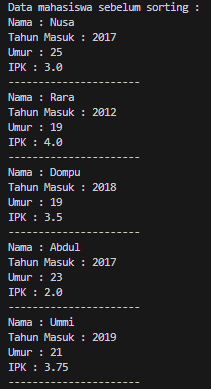<br>
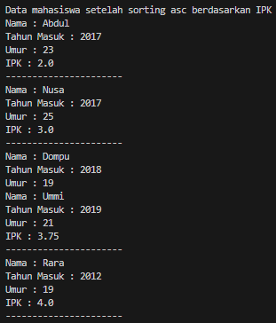<br>
## Pertanyaan
Ubahlah fungsi pada InsertionSort sehingga fungsi ini dapat melaksanakan proses sorting dengan cara descending.
Modifikasi ke descending<br>
```java
void insertionSort() {
        for (int i = 1; i < listMhs.length; i++) {
            Mahasiswa01 temp = listMhs[i];
            int j = i;
            while (j > 0 && listMhs[j - 1].ipk < temp.ipk) {
                listMhs[j] = listMhs[j - 1];
                j--;
            }
            listMhs[j] = temp;
        }
    }
```
Output<br>
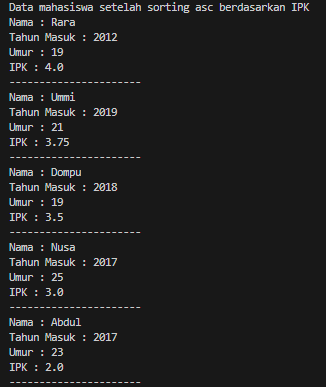
# Latihan Praktikum
Sebuah platform travel yang menyediakan layanan pemesanan kebutuhan travelling sedang mengembangkan backend untuk sistem pemesanan/reservasi akomodasi (penginapan), salah satu fiturnya adalah menampilkan daftar penginapan yang tersedia berdasarkan pilihan filter yang diinginkan user. Daftar penginapan ini harus dapat disorting berdasarkan

1. Harga dimulai dari harga termurah ke harga tertinggi.
2. Rating bintang penginapan dari bintang tertinggi (5) ke terendah (1)<br>
Buatlah proses sorting data untuk kedua filter tersebut dengan menggunakan algoritma bubble sort dan selection sort.<br>
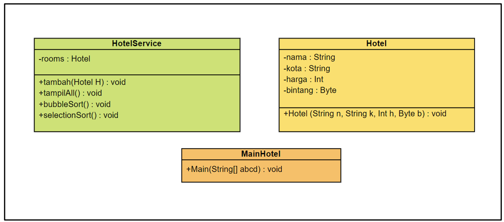<br>
Jawab : Ini adalah codenya<br>
```java
public class Hotel02 {
    String nama, kota;
    int harga;
    Byte bingtang;

    Hotel02(String n, String k, int h, Byte b) {
        nama = n;
        kota = k;
        harga = h;
        bingtang = b;
    }

    void tampil() {
        System.out.println("Nama : " + nama);
        System.out.println("Kota : " + kota);
        System.out.println("Harga : " + harga);
        System.out.println("Bintang : " + bingtang);
    }
}
```
```java
public class Hotelservice02 {
    Hotel02 hotel[] = new Hotel02[5];
    int idx;

    void tambah(Hotel02 h) {
        if (idx < hotel.length) {
            hotel[idx] = h;
            idx++;
        } else {
            System.out.println("Data sudah penuh!!");
        }
    }

    void tampil() {
        for (Hotel02 h : hotel) {
            h.tampil();
            System.out.println("----------------------");
        }
    }

    public void bubbleSortHarga() {
        for (int i = 0; i < idx - 1; i++) {
            for (int j = 0; j < idx - i - 1; j++) {
                if (hotel[j].harga > hotel[j + 1].harga) {
                    Hotel02 temp = hotel[j];
                    hotel[j] = hotel[j + 1];
                    hotel[j + 1] = temp;
                }
            }
        }
    }

    public void selectionSortRating() {
        for (int i = 0; i < idx - 1; i++) {
            int idxMax = i;
            for (int j = i + 1; j < idx; j++) {
                if (hotel[j].bingtang > hotel[idxMax].bingtang) {
                    idxMax = j;
                }
            }
            Hotel02 temp = hotel[idxMax];
            hotel[idxMax] = hotel[i];
            hotel[i] = temp;
        }
    }
}
```
```java
import java.util.Scanner;
public class Mainhotel02 {
    public static void main(String[] args) {
        Hotelservice02 list = new Hotelservice02();
        Hotel02 h1 = new Hotel02("Hotel A", "Jakarta", 200000, (byte) 3);
        Hotel02 h2 = new Hotel02("Hotel B", "Bandung", 150000, (byte) 4);
        Hotel02 h3 = new Hotel02("Hotel C", "Malang", 300000, (byte) 5);
        Hotel02 h4 = new Hotel02("Hotel D", "Surabaya", 180000, (byte) 2);
        Hotel02 h5 = new Hotel02("Hotel E", "Semarang", 250000, (byte) 1);

        list.tambah(h1);
        list.tambah(h2);
        list.tambah(h3);
        list.tambah(h4);
        list.tambah(h5);

        System.out.println("Data Hotel sebelum sorting : ");
        list.tampil();

        System.out.println("Data Hotel setelah sorting asc berdasarkan Harga");
        list.bubbleSortHarga();
        list.tampil();

        System.out.println("Data Hotel setelah sorting desc berdasarkan Bintang");
        list.selectionSortRating();
        list.tampil();
    }
}
```
Output<br>
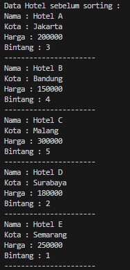<br>
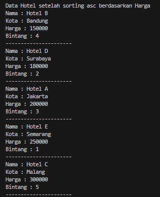<br>
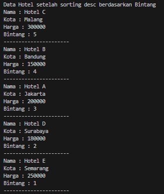<br>