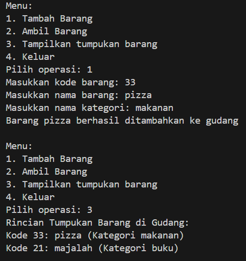
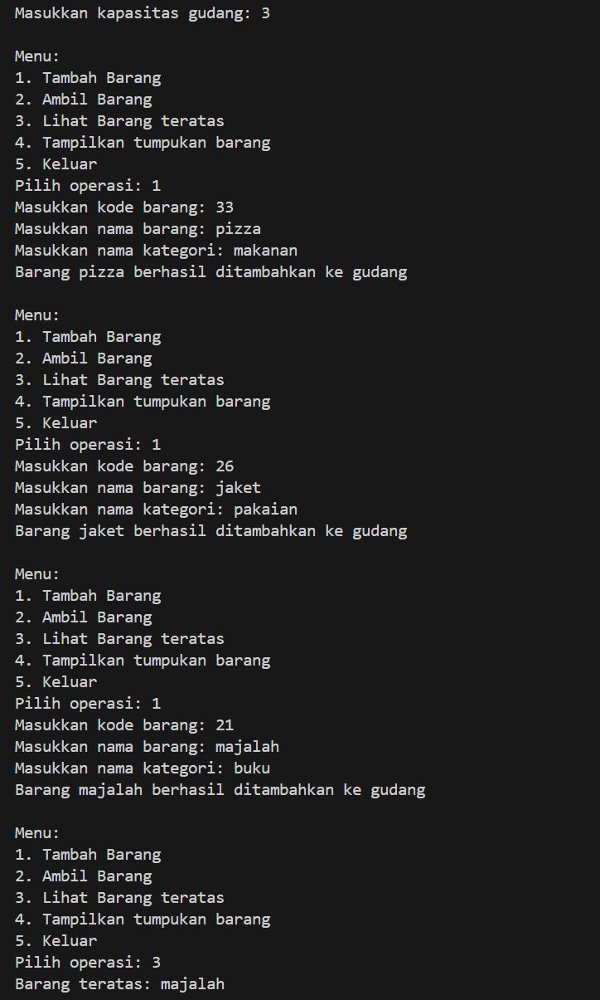
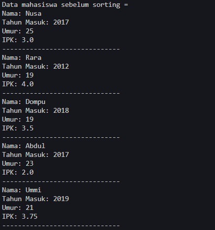
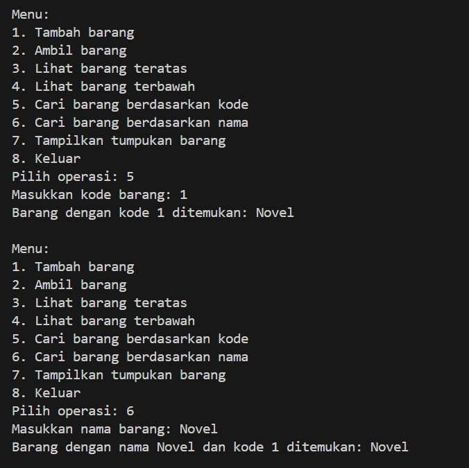

# <p align ="center">  LAPORAN PRAKTIKUM ALGORITMA DAN STRUKTUR DATA </p> 
<br><br><br><br>

<p align="center">
    </p>

<br><br><br><br><br>


<p align = "center"> Nama : Adnan Arju Maulana Pasha </p>
<p align = "center"> NIM  : 2341720107 </p>
<p align = "center"> Prodi: TEKNIK INFOMATIKA</p>
<p align = "center"> Kelas: 1B </p>
<br><br><br><br><br>

# Percobaan 1 : Penyimpanan Tumpukan Barang dalam Gudang
Ini adalah SS dari kode programnya dan sesuai dengan hasil percobaan<br>
```java
public class Barang02 {
    int kode ;
    String nama ;
    String kategori ;
    public Barang02(int kode, String nama, String kategori) {
        this.kode = kode;
        this.nama = nama;
        this.kategori = kategori;
}
}
```
```java
public class Gudang02 {
    Barang02[] tumpukan;
    int size ;
    int top;
    public Gudang02(int kapasitas) {
        size = kapasitas;
        tumpukan = new Barang02[size];
        top = -1;
    }
    public boolean cekKosong() {
        if (top == -1) {
            return true;
        } else {
            return false;
        }
    }
    public boolean cekPenuh() {
        return top == size - 1;
    }
    public boolean isEmpty() {
        return top == -1;
    }
    public void tambahBarang(Barang02 brg) {
        if (!cekPenuh()) {
            top++;
            tumpukan[top] = brg;
            System.out.println("Barang " + brg.nama + " berhasil ditambahkan ke gudang");
        } else {
            System.out.println("Gagal! Tumpukan barang di Gudang sudah penuh");
        }
    }
    public Barang02 ambilBarang() {
        if (!cekKosong()) {
            Barang02 delete = tumpukan[top];
            top--;
            System.out.println("Barang " + delete.nama + " diambil dari gudang");
            return delete;
        } else {
            System.out.println(" Tumpukan barang kosong");
            return null;
        }
    }
    public Barang02 lihatBarangTeratas() {
        if (!isEmpty()) {
            Barang02 barangTeratas = tumpukan[top];
            System.out.println("Barang teratas: " + barangTeratas.nama); 
            return barangTeratas;
        } else {
            System.out.println("Tumpukan barang kosong");
            return null;
        }
    }
    public void tampilkanBarang() {
        if (!cekKosong()) {
            System.out.println("Rincian Tumpukan Barang di Gudang: ");
            //for (int i = top; i >= 0; i--) {
            for (int i = top ; i >= 0; i--) {
                System.out.printf("Kode %d: %s (Kategori %s)\n", tumpukan[i].kode, tumpukan[i].nama, tumpukan[i].kategori);
            }
        } else {
            System.out.println("Tumpukan barang kosong");
        }
    }
}
```
```java
import java.util.Scanner;

public class Utama02 {
    public static void main(String[] args) {
        Scanner sc = new Scanner(System.in);
        Gudang02 gudang = new Gudang02(7);
        while (true) {
            System.out.println("\nMenu: ");
            System.out.println("1. Tambah Barang");
            System.out.println("2. Ambil Barang");
            System.out.println("3. Tampilkan tumpukan barang");
            System.out.println("4. Keluar");
            System.out.print("Pilih operasi: ");
            int pilihan = sc.nextInt();
            sc.nextLine();
            switch (pilihan) {
                case 1:
                System.out.print("Masukkan kode barang: ");
                int kode = sc.nextInt();
                sc.nextLine();
                System.out.print("Masukkan nama barang: ");
                String nama = sc.nextLine();
                System.out.print("Masukkan nama kategori: ");
                String kategori = sc.nextLine();
                Barang02 barangBaru = new Barang02(kode, nama, kategori);
                gudang.tambahBarang(barangBaru);
                break;
                case 2:
                gudang.ambilBarang();
                break;
                case 3:
                gudang.tampilkanBarang();
                break;
                case 4:
                break;
                default:
                System.out.println("Pilihan tidak valid. Silahkan coba lagi");
        }
        
    }
}
}
```
Output<br>
](Pertemuanke8/img/image.png)


## Pertanyaan
1. . Lakukan perbaikan pada kode program, sehingga keluaran yang dihasilkan sama dengan verifikasi
hasil percobaan! Bagian mana saja yang perlu diperbaiki?<br>
Jawab : dengan modifikasi program dibawah ini
```java
public void tampilkanBarang() {
        if (!cekKosong()) {
            System.out.println("Rincian Tumpukan Barang di Gudang: ");
            //for (int i = top; i >= 0; i--) {
            for (int i = top ; i >= 0; i--) {
                System.out.printf("Kode %d: %s (Kategori %s)\n", tumpukan[i].kode, tumpukan[i].nama, tumpukan[i].kategori);
            }
        } else {
            System.out.println("Tumpukan barang kosong");
        }
    }
```
2. Berapa banyak data barang yang dapat ditampung di dalam tumpukan? Tunjukkan potongan kode
programnya!<br>
Jawab : <br>
Kode dibawah ini menunjukkan bahwa maksimal 7 data barang dapat ditampung dalam tumpukan di gudang. 
```java
 Gudang02 gudang = new Gudang02(7);
 ```
3. Mengapa perlu pengecekan kondisi !cekKosong() pada method tampilkanBarang? Kalau kondisi
tersebut dihapus, apa dampaknya?<br>
Jawab : <br>
Pengecekan kondisi !cekKosong() pada method tampilkanBarang dilakukan untuk memastikan bahwa tumpukan barang tidak kosong sebelum menampilkan rincian tumpukan barang. Jika kondisi tersebut dihapus, maka ada potensi untuk mencoba mengakses indeks tumpukan yang tidak valid, yang dapat menyebabkan error saat mencoba mengakses tumpukan yang kosong.
4. Modifikasi kode program pada class Utama sehingga pengguna juga dapat memilih operasi lihat
barang teratas, serta dapat secara bebas menentukan kapasitas gudang!<br>
Jawab :
```java
import java.util.Scanner;

public class Utama02 {
    public static void main(String[] args) {
        Scanner sc = new Scanner(System.in);
        System.out.print("Masukkan kapasitas gudang: ");
        int kapasitas = sc.nextInt();
        sc.nextLine();
        Gudang02 gudang = new Gudang02(7);
        while (true) {
            System.out.println("\nMenu: ");
            System.out.println("1. Tambah Barang");
            System.out.println("2. Ambil Barang");
            System.out.println("3. Lihat Barang teratas");
            System.out.println("4. Tampilkan tumpukan barang");
            System.out.println("5. Keluar");
            System.out.print("Pilih operasi: ");
            int pilihan = sc.nextInt();
            sc.nextLine();
            switch (pilihan) {
                case 1:
                System.out.print("Masukkan kode barang: ");
                int kode = sc.nextInt();
                sc.nextLine();
                System.out.print("Masukkan nama barang: ");
                String nama = sc.nextLine();
                System.out.print("Masukkan nama kategori: ");
                String kategori = sc.nextLine();
                Barang02 barangBaru = new Barang02(kode, nama, kategori);
                gudang.tambahBarang(barangBaru);
                break;
                case 2:
                gudang.ambilBarang();
                break;
                case 3:
                gudang.lihatBarangTeratas();
                break;
                case 4:
                gudang.tampilkanBarang();
                break;
                case 5:
                break;
                default:
                System.out.println("Pilihan tidak valid. Silahkan coba lagi");
        }
        
    }
}
}
```
Output<br>

# Percobaan 2 : Konversi Kode Barang ke Biner 
Ini adalah SS dari kode programnya dan sesuai dengan hasil percobaan<br>
```java
public class StackKonversi02 {
    int size;
    int[] tumpukanBiner;
    int top;
    public StackKonversi02() {
        this.size = 32;
        tumpukanBiner = new int[size];
        top = -1;
    }
    public boolean isEmpty() {
        return top == -1;
    }
    public boolean isFull() {
        return top == size - 1;
    }
    public void push(int data) {
        if (isFull()) {
            System.out.println("Stack penuh");
        } else {
            top++;
            tumpukanBiner[top] = data;
        }
    }
    public int pop() {
        if (isEmpty()) {
            System.out.println("Stack kosong");
            return -1;
        } else {
            int data = tumpukanBiner[top];
            top--;
            return data;
        }
    }
}
```
```java
public class Gudang02 {
    Barang02[] tumpukan;
    int size ;
    int top;
    public Gudang02(int kapasitas) {
        size = kapasitas;
        tumpukan = new Barang02[size];
        top = -1;
    }
    public boolean cekKosong() {
        if (top == -1) {
            return true;
        } else {
            return false;
        }
    }
    public boolean cekPenuh() {
        return top == size - 1;
    }
    public boolean isEmpty() {
        return top == -1;
    }
    public void tambahBarang(Barang02 brg) {
        if (!cekPenuh()) {
            top++;
            tumpukan[top] = brg;
            System.out.println("Barang " + brg.nama + " berhasil ditambahkan ke gudang");
        } else {
            System.out.println("Gagal! Tumpukan barang di Gudang sudah penuh");
        }
    }
    public Barang02 ambilBarang() {
        if (!cekKosong()) {
            Barang02 delete = tumpukan[top];
            top--;
            System.out.println("Barang " + delete.nama + " diambil dari gudang");
            System.out.println("Kode unik dalam biner: " + konversiDesimalKeBiner(delete.kode));
            return delete;
        } else {
            System.out.println(" Tumpukan barang kosong");
            return null;
        }
    }
    public Barang02 lihatBarangTeratas() {
        if (!isEmpty()) {
            Barang02 barangTeratas = tumpukan[top];
            System.out.println("Barang teratas: " + barangTeratas.nama); 
            return barangTeratas;
        } else {
            System.out.println("Tumpukan barang kosong");
            return null;
        }
    }
    public void tampilkanBarang() {
        if (!cekKosong()) {
            System.out.println("Rincian Tumpukan Barang di Gudang: ");
            //for (int i = top; i >= 0; i--) {
            for (int i = top ; i >= 0; i--) {
                System.out.printf("Kode %d: %s (Kategori %s)\n", tumpukan[i].kode, tumpukan[i].nama, tumpukan[i].kategori);
            }
        } else {
            System.out.println("Tumpukan barang kosong");
        }
    }
    public String konversiDesimalKeBiner(int kode){
        StackKonversi02 stack = new StackKonversi02();
        while(kode>0){
            int sisa = kode % 2;
            stack.push(sisa);
            kode = kode / 2;
        }
        String biner = new String();
        while(!stack.isEmpty()){
            biner += stack.pop();
        }
        return biner;
    }
}
```
```java
import java.util.Scanner;

public class Utama02 {
    public static void main(String[] args) {
        Scanner sc = new Scanner(System.in);
        System.out.print("Masukkan kapasitas gudang: ");
        int kapasitas = sc.nextInt();
        sc.nextLine();
        Gudang02 gudang = new Gudang02(7);
        while (true) {
            System.out.println("\nMenu: ");
            System.out.println("1. Tambah Barang");
            System.out.println("2. Ambil Barang");
            System.out.println("3. Lihat Barang teratas");
            System.out.println("4. Tampilkan tumpukan barang");
            System.out.println("5. Keluar");
            System.out.print("Pilih operasi: ");
            int pilihan = sc.nextInt();
            sc.nextLine();
            switch (pilihan) {
                case 1:
                System.out.print("Masukkan kode barang: ");
                int kode = sc.nextInt();
                sc.nextLine();
                System.out.print("Masukkan nama barang: ");
                String nama = sc.nextLine();
                System.out.print("Masukkan nama kategori: ");
                String kategori = sc.nextLine();
                Barang02 barangBaru = new Barang02(kode, nama, kategori);
                gudang.tambahBarang(barangBaru);
                break;
                case 2:
                gudang.ambilBarang();
                break;
                case 3:
                gudang.lihatBarangTeratas();
                break;
                case 4:
                gudang.tampilkanBarang();
                break;
                case 5:
                break;
                default:
                System.out.println("Pilihan tidak valid. Silahkan coba lagi");
        }
        
    }
}
}
```
Output<br>
](Pertemuanke8/img/image3.png)
## Pertanyaan
1. . Pada method konversiDesimalKeBiner, ubah kondisi perulangan menjadi while (kode != 0),
bagaimana hasilnya? Jelaskan alasannya!<br>
Jawab :<br>
 Dengan mengubah kondisi perulangan menjadi while (kode != 0), kita memastikan bahwa perulangan dilakukan selama kode tidak sama dengan 0. Ini diperlukan karena pada proses konversi desimal ke biner, kita harus terus membagi kode sampai kode sama dengan 0. Dengan demikian, kita dapat yakin bahwa proses konversi tersebut akan berjalan dengan benar.
2. Jelaskan alur kerja dari method konversiDesimalKeBiner!<br>
Jawab :<br>
Berikut adalah alur kerjanya:<br>
-Buat objek StackKonversi02 yang berfungsi sebagai tumpukan untuk menyimpan sisa pembagian.<br>
-Selama kode masih lebih besar dari 0,Hitung sisa pembagian sisa dari kode dibagi dengan 2.Masukkan sisa ke dalam stack.Bagi kode dengan 2 untuk mendapatkan nilai baru.<br>
-Setelah selesai perulangan, buat string biner yang akan menampung representasi biner hasil konversi.<br>
-Selama stack belum kosong,Keluarkan elemen dari stack dan tambahkan ke string biner.<br>
-Kembalikan nilai biner yang berisi representasi biner dari bilangan desimal awal.<br>
Dengan alur ini, metode konversiDesimalKeBiner akan mengonversi bilangan desimal ke biner dengan benar dan mengembalikan string biner sebagai hasilnya.
# Percobaan 3 : Konversi Notasi Infix ke Postfix
Ini adalah SS dari kode programnya dan sesuai dengan hasil percobaan<br>
```java
public class Postfix02 {
    int n;
    int top;
    char[] stack;
    public Postfix02 (int total) {
        n = total;
        top = -1;
        stack = new char[n];
        push('(');
    }
    public void push(char c) {
        top++;
        stack[top] = c;
    }
    public char pop() {
        char item = stack[top];
        top--;
        return item;
    }
    public boolean IsOperand(char c) {
        if ((c >= 'A' && c <= 'Z') || (c >= 'a' && c <= 'z') || (c >= '0' && c <= '9') || c == ' ' || c == '.') {
            return true;
        } else {
            return false;
        }
    }
    public boolean IsOperator(char c) {
        if (c == '^' || c == '%' || c == '/' || c == '*' || c == '-' || c == '+') {
            return true;
        } else {
            return false;
        }
    }
    public int derajat(char c) {
        switch (c) {
            case '^': return 3;
            case '%': return 2;
            case '*': return 2;
            case '/': return 2;
            case '+': return 1;
            case '-': return 1;
            default: return 0;
        }
    }
    public String konversi(String Q) {
        String P = "";
        char c;
        for (int i = 0; i < n; i++) {
            c = Q.charAt(i);
            if (IsOperand(c)) {
                P = P + c;
            }
            if (c == '(') {
                push(c);
            }
            if (c == ')') {
                while (stack[top] != '(') {
                    P = P + pop();
                }
                pop();
            }
            if (IsOperator(c)) {
               while (derajat (stack[top]) >= derajat(c)) {
                   P = P + pop();
               }
               push(c);
            }
        }
        return P;
    } 
}
```
```java
import java.util.Scanner;

public class PostfixMain02 {

    public static void main(String[] args) {
        Scanner sc = new Scanner(System.in);
        String P, Q;
        System.out.println("Masukkan ekspresi matematika (infix): ");
        Q = sc.nextLine();
        Q = Q.trim();
        Q = Q + ")";
        int total = Q.length();
        Postfix02 post = new Postfix02(total);
        P = post.konversi(Q);
        System.out.println("Postfix: " + P);
    }
}
```
Output<br>
](Pertemuanke8/img/image4.png)
## Pertanyaan
1. Pada method derajat, mengapa return value beberapa case bernilai sama? Apabila return
value diubah dengan nilai berbeda-beda setiap case-nya, apa yang terjadi?<br>
Jawab : <br>
Pada method derajat, return value beberapa case memiliki nilai yang sama karena operator-operator tersebut memiliki prioritas yang sama dalam ekspresi matematika. Jika return value diubah dengan nilai yang berbeda-beda setiap case-nya, maka prioritas operator dalam konversi ekspresi matematika dari infix menjadi postfix akan berubah sesuai dengan nilai yang di-return. Hal ini dapat mengakibatkan hasil konversi postfix dari ekspresi matematika menjadi tidak sesuai atau tidak benar.
2. Jelaskan alur kerja method konversi!<br>
Jawab :<br>
-Inisialisasi string kosong P untuk menyimpan ekspresi postfix.<br>
-Iterasi setiap karakter c dalam ekspresi infix input Q.<br>
-Jika c adalah operand (huruf, angka, spasi, atau titik), tambahkan langsung ke string postfix P.<br>
-Jika c adalah tanda kurung buka (, dorong ke dalam tumpukan.<br>
-Jika c adalah tanda kurung tutup ), keluarkan dan tambahkan operator dari tumpukan ke P sampai tanda kurung buka ( ditemui. Keluarkan tanda kurung buka dari tumpukan.<br>
-Jika c adalah operator (^, %, /, *, -, +), bandingkan presedensinya dengan preseden operator di puncak tumpukan. Jika operator puncak memiliki preseden yang lebih tinggi atau sama, keluarkan dan tambahkan ke P. Ulangi proses ini sampai tumpukan kosong atau suatu operator dengan preseden yang lebih rendah ditemui. Terakhir, dorong operator saat ini c ke dalam tumpukan.<br>
-Setelah semua karakter dalam ekspresi input diproses, kembalikan ekspresi postfix P.
3. Pada method konversi, apa fungsi dari potongan kode berikut?<br>
```java
c = Q.charAt(i);
```
Jawab : <br>
Potongan kode c = Q.charAt(i); digunakan untuk mengambil karakter pada posisi i dari string Q dan menyimpannya ke dalam variabel c. Dengan menggunakan metode charAt(i), kita dapat mengakses karakter pada indeks tertentu dalam string. Dalam konteks ini, potongan kode tersebut digunakan dalam method konversi untuk mengambil karakter saat ini yang sedang diproses di indeks i dari ekspresi matematika input yang diterima. Karakter ini kemudian dianalisis apakah operand, operator, atau tanda kurung, dan diolah sesuai aturan konversi dari infix ke postfix.
# Latihan Praktikum
Perhatikan dan gunakan kembali kode program pada Percobaan 1. Tambahkan dua method berikut
pada class Gudang:<br>
• Method lihatBarangTerbawah digunakan untuk mengecek barang pada tumpukan terbawah<br>
• Method cariBarang digunakan untuk mencari ada atau tidaknya barang berdasarkan kode
barangnya atau nama barangnya<br>
Jawab :
```java
public class Gudang02 {
    Barang02[] tumpukan;
    int size, top;

    public Gudang02(int kapasitas) {
        size = kapasitas;
        tumpukan = new Barang02[size];
        top = -1;
    }

    public boolean cekKosong() {
        if (top == -1) {
            return true;
        } else {
            return false;
        }
    }

    public boolean cekPenuh() {
        if (top == size - 1) {
            return true;
        } else {
            return false;
        }
    }

    public boolean isEmpty() {
        return top == -1;
    }

    public void tambahBarang(Barang02 brg) {
        if (!cekPenuh()) {
            top++;
            tumpukan[top] = brg;
            System.out.println("Barang " + brg.nama + " berhasil ditambahkan ke Gudang");
        } else {
            System.out.println("Gagal! Tumpukan barang di Gudang sudah penuh");
        }
    }

    public Barang02 ambilBarang() {
        if (!cekKosong()) {
            Barang02 delete = tumpukan[top];
            top--;
            System.out.println("Barang " + delete.nama + " diambil dari Gudang.");
            System.out.println("Kode unik dalam biner: " + konversiDesimalKeBiner(delete.kode));
            return delete;
        } else {
            System.out.println("Tumpukan barang kosong");
            return null;
        }
    }

    public Barang02 lihatBarangTeratas() {
        if (!isEmpty()) {
            Barang02 barangTeratas = tumpukan[top];
            System.out.println("Barang teratas: " + barangTeratas.nama);
            return barangTeratas;
        } else {
            System.out.println("Tumpukan barang kosong.");
            return null;
        }
    }

    public Barang02 lihatBarangTerbawah() {
        if (!isEmpty()) {
            Barang02 barangTerbawah = tumpukan[0];
            System.out.println("Barang terbawah: " + barangTerbawah.nama);
            return barangTerbawah;
        } else {
            System.out.println("Tumpukan barang kosong.");
            return null;
        }
    }

    public Barang02 cariBarangKode(int kodeBarang) {
        for (int i = 0; i <= top; i++) {
            if (tumpukan[i].kode == kodeBarang) {
                return tumpukan[i];
            }
        }
        return null;
    }

    public Barang02 cariBarangNama(String namaBarang) {
        for (int i = 0; i <= top; i++) {
            if (tumpukan[i].nama.equals(namaBarang)) {
                return tumpukan[i];
            }
        }
        return null;
    }

    public void tampilkanBarang() {
        if (!cekKosong()) {
            System.out.println("Rincian tumpukan barang di Gudang: ");
            // for (int j = top; j >= 0; j--) {
            for (int i = top; i >= 0; i--) {
                System.out.printf("Kode %d: %s (Kategori %s)\n", tumpukan[i].kode, tumpukan[i].nama,
                        tumpukan[i].kategori);
            }
        } else {
            System.out.println("Tumpukan barang kosong.");
        }
    }

    public String konversiDesimalKeBiner(int kode) {
        StackKonversi02 stack = new StackKonversi02();
        while (kode > 0) {
            int sisa = kode % 2;
            stack.push(sisa);
            kode = kode / 2;
        }
        String biner = new String();
        while (!stack.isEmpty()) {
            biner += stack.pop();
        }
        return biner;
    }
}
```
```java
import java.util.Scanner;

public class Utama02 {
    public static void main(String[] args) {
        Scanner scanner = new Scanner(System.in);

        String nama = "";
        int kode = 0;

        System.out.print("Masukkan kapasitas gudang: ");
        int kapasitas = scanner.nextInt();
        scanner.nextLine();

        Gudang02 gudang = new Gudang02(kapasitas);

        while (true) {
            System.out.println("\nMenu:");
            System.out.println("1. Tambah barang");
            System.out.println("2. Ambil barang");
            System.out.println("3. Lihat barang teratas");
            System.out.println("4. Lihat barang terbawah");
            System.out.println("5. Cari barang berdasarkan kode");
            System.out.println("6. Cari barang berdasarkan nama");
            System.out.println("7. Tampilkan tumpukan barang");
            System.out.println("8. Keluar");
            System.out.print("Pilih operasi: ");
            int pilihan = scanner.nextInt();
            scanner.nextLine();

            switch (pilihan) {
                case 1:
                    System.out.print("Masukkan kode barang: ");
                    kode = scanner.nextInt();
                    scanner.nextLine();
                    System.out.print("Masukkan nama barang: ");
                    nama = scanner.nextLine();
                    System.out.print("Masukkan nama kategori: ");
                    String kategori = scanner.nextLine();
                    Barang02 barangBaru = new Barang02(kode, nama, kategori);
                    gudang.tambahBarang(barangBaru);
                    break;
                case 2:
                    gudang.ambilBarang();
                    break;
                case 3:
                    gudang.lihatBarangTeratas();
                    break;
                case 4:
                    gudang.lihatBarangTerbawah();
                    break;
                case 5:
                    System.out.print("Masukkan kode barang: ");
                    kode = scanner.nextInt();
                    scanner.nextLine();
                    Barang02 barangDitemukan = gudang.cariBarangKode(kode);
                    if (barangDitemukan != null) {
                        System.out.println("Barang dengan kode " + kode + " ditemukan: " + barangDitemukan.nama);
                    } else {
                        System.out.println("Barang dengan kode " + kode + " tidak ditemukan.");
                    }
                    break;
                case 6:
                    System.out.print("Masukkan nama barang: ");
                    nama = scanner.nextLine();
                    barangDitemukan = gudang.cariBarangNama(nama);
                    if (barangDitemukan != null) {
                        System.out.println("Barang dengan nama " + nama + " dan kode " + kode + " ditemukan: "
                                + barangDitemukan.nama);
                    } else {
                        System.out.println("Barang dengan nama " + nama + " tidak ditemukan.");
                    }
                    break;
                case 7:
                    gudang.tampilkanBarang();
                    break;
                default:
                    System.out.println("Pilihan tidak valid. Silakan coba lagi.");
            }
        }
    }
}
```
Output<br>
](Pertemuanke8/img/image5.png)
